# Transform Army AI - System Architecture

**Version:** 1.0.0  
**Last Updated:** 2025-10-31  
**Status:** Design Phase

---

## Table of Contents

1. [Executive Summary](#executive-summary)
2. [Architectural Principles](#architectural-principles)
3. [System Overview](#system-overview)
4. [Three-Layer Architecture](#three-layer-architecture)
5. [Component Architecture](#component-architecture)
6. [Data Flow Patterns](#data-flow-patterns)
7. [Security Architecture](#security-architecture)
8. [Integration Architecture](#integration-architecture)
9. [Migration Strategy](#migration-strategy)
10. [Technology Stack](#technology-stack)
11. [Quality Attributes](#quality-attributes)

---

## Executive Summary

Transform Army AI is a white-label Business Transformation platform that provides multi-agent AI capabilities for services firms and mid-market operations teams. The architecture follows a strategic migration path from Relevance AI to a proprietary platform, ensuring minimal disruption while maximizing time-to-market.

### Key Architectural Decisions

- **Three-layer approach**: Relevance-native → Adapter layer → Proprietary platform
- **Vendor-agnostic design**: Contract-first API design enables seamless provider swapping
- **Multi-agent orchestration**: LangGraph state machines coordinate AI workforce
- **Tenant isolation**: Multi-tenancy with strict data segregation and RBAC
- **Metered billing**: Actions/Credits model with BYO LLM key support

---

## Architectural Principles

### 1. Portability First
All integrations flow through vendor-agnostic adapter contracts, enabling migration without client disruption.

### 2. Contract-First Design
API contracts, schemas, and interfaces are defined before implementation, ensuring consistency and testability.

### 3. Progressive Enhancement
Start with Relevance AI primitives, add adapter layer, gradually migrate to proprietary orchestration.

### 4. Fail-Safe Defaults
Idempotent operations, correlation IDs for tracing, automatic retries with exponential backoff.

### 5. Multi-Tenancy by Design
Tenant isolation at data, compute, and configuration layers with namespace-based segregation.

### 6. Observable Systems
Comprehensive logging, metrics, and tracing for all agent actions and system operations.

---

## System Overview

### High-Level Architecture

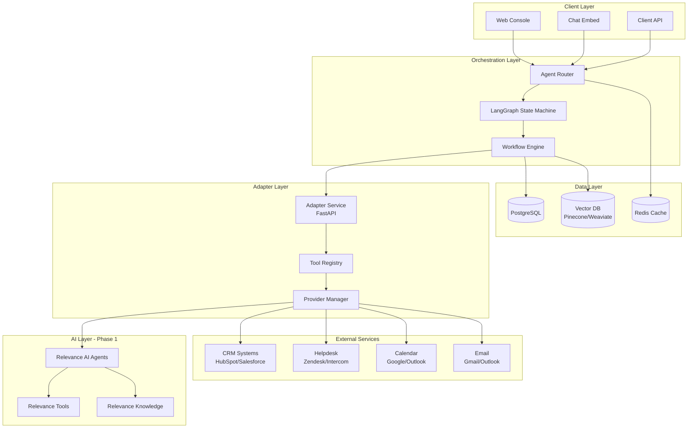

### Component Responsibilities

| Component | Responsibility | Phase |
|-----------|---------------|-------|
| **Web Console** | Operator dashboard, tenant config, analytics | Phase 1 |
| **Chat Embed** | Client-facing conversational interface | Phase 1 |
| **Agent Router** | Request routing, auth, rate limiting | Phase 2 |
| **LangGraph State Machine** | Multi-agent coordination, state management | Phase 3 |
| **Adapter Service** | Vendor-agnostic tool interface | Phase 2 |
| **Tool Registry** | Dynamic tool discovery and validation | Phase 2 |
| **Relevance AI** | Initial agent orchestration platform | Phase 1 |
| **PostgreSQL** | Transactional data, audit logs, configs | Phase 2 |
| **Vector DB** | Knowledge embeddings, semantic search | Phase 3 |
| **Redis** | Session cache, rate limiting, job queues | Phase 2 |

---

## Three-Layer Architecture

### Phase 1: Relevance-Native (Weeks 1-4)

**Objective**: Ship value immediately using Relevance AI primitives

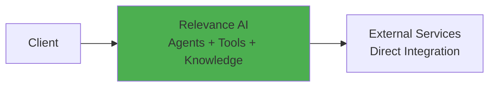

**Characteristics**:
- Direct use of Relevance Agents, Tools, Knowledge, and Workforce
- Embeds and share links for distribution
- Vendor credits for model costs
- Manual tenant provisioning via Relevance UI

**Deliverables**:
- 6 base agents (BDR, Support, Research, Ops, Librarian, QA)
- CRM/Helpdesk/Calendar/Email tool integrations
- Knowledge tables per client
- Chat embed templates
- Workforce templates with deterministic variable passing

### Phase 2: Adapter Layer Introduction (Weeks 5-12)

**Objective**: Add portability while maintaining Relevance for orchestration

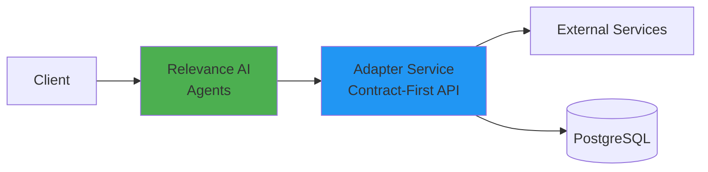

**Characteristics**:
- Relevance agents call adapter endpoints instead of direct integrations
- Adapter implements vendor-agnostic contracts
- Audit logging and correlation tracking
- Tenant-specific configuration in PostgreSQL
- Idempotent operations with retry logic

**Deliverables**:
- FastAPI adapter service with REST endpoints
- Provider plugins for CRM/Helpdesk/Calendar/Email
- Schema definitions (Pydantic + Zod)
- Audit trail system
- Tenant configuration management

### Phase 3: Hybrid Orchestration (Weeks 13-24)

**Objective**: Gradually migrate orchestration logic while keeping Relevance embeds

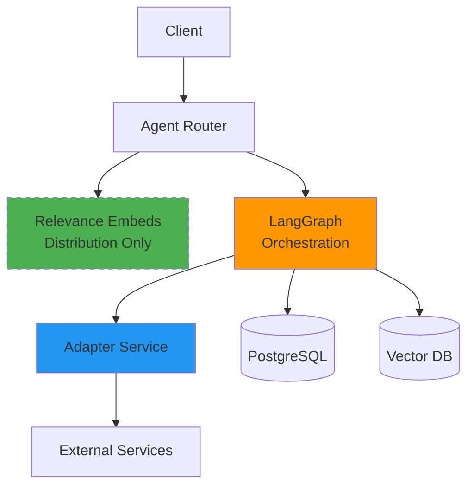

**Characteristics**:
- LangGraph handles multi-agent state management
- Relevance used only for chat embeds and share links
- Custom workflow engine with approval gates
- Vector database for knowledge retrieval
- Advanced analytics and cost attribution

**Deliverables**:
- LangGraph state machines for agent coordination
- Custom workflow engine
- Vector DB integration (Pinecone/Weaviate)
- Advanced metering and billing
- Operator dashboard with real-time monitoring

### Phase 4+: Proprietary Platform (Months 7+)

**Objective**: Full control of stack, on-premise deployments

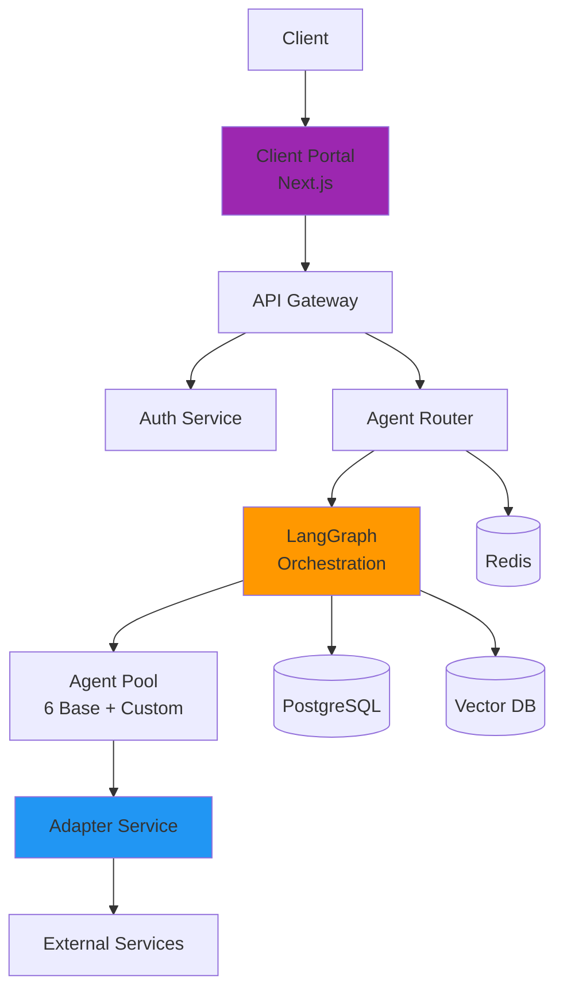

**Characteristics**:
- No Relevance AI dependencies
- Custom chat widget and embeds
- SSO/SAML integration
- VPC and air-gapped deployments
- Advanced RBAC and compliance controls

**Deliverables**:
- Complete Next.js operator console and client portal
- Custom chat widget for embeds
- SSO/SAML authentication
- VPC deployment configurations
- Enterprise security controls

---

## Component Architecture

### Monorepo Structure

```
transform-army-ai/
├── apps/
│   ├── web/                    # Next.js operator console & client portal
│   │   ├── src/
│   │   │   ├── app/           # App router pages
│   │   │   ├── components/    # React components
│   │   │   ├── lib/           # Client utilities
│   │   │   └── config/        # Environment configs
│   │   └── package.json
│   │
│   ├── adapter/               # FastAPI adapter service
│   │   ├── src/
│   │   │   ├── api/          # Route handlers
│   │   │   ├── providers/    # Vendor implementations
│   │   │   ├── core/         # Business logic
│   │   │   └── models/       # Data models
│   │   ├── tests/
│   │   └── pyproject.toml
│   │
│   └── evals/                 # QA and evaluation harness
│       ├── rubrics/           # Scoring rubrics
│       ├── scenarios/         # Test scenarios
│       └── runners/           # Test execution
│
├── packages/
│   ├── agents/                # Agent definitions and prompts
│   │   ├── bdr-concierge/
│   │   ├── support-concierge/
│   │   ├── research-recon/
│   │   ├── ops-sapper/
│   │   ├── knowledge-librarian/
│   │   └── qa-auditor/
│   │
│   ├── tools/                 # Vendor-agnostic tool wrappers
│   │   ├── crm/
│   │   ├── helpdesk/
│   │   ├── calendar/
│   │   └── email/
│   │
│   ├── schema/                # Shared data models
│   │   ├── python/           # Pydantic models
│   │   └── typescript/       # Zod schemas
│   │
│   ├── prompt-pack/           # System prompts and templates
│   └── orchestration/         # LangGraph workflows
│
├── infra/
│   ├── compose/               # Docker Compose configs
│   ├── terraform/             # IaC for cloud deployments
│   └── k8s/                   # Kubernetes manifests
│
├── .cursor/
│   ├── rules/                 # Cursor AI rules
│   └── memory-bank/           # Project context
│
└── docs/                      # Technical documentation
    ├── adapter-contract.md
    ├── agent-orchestration.md
    └── deployment-guide.md
```

### Core Services

#### 1. Adapter Service (FastAPI)

**Purpose**: Vendor-agnostic interface for all external integrations

**Key Endpoints**:
- `POST /v1/tickets/create` - Create helpdesk ticket
- `POST /v1/meetings/book` - Schedule calendar meeting
- `POST /v1/crm/notes` - Add CRM note/activity
- `POST /v1/email/send` - Send email
- `POST /v1/knowledge/search` - Search knowledge base

**Responsibilities**:
- Request validation using Pydantic models
- Provider routing based on tenant configuration
- Retry logic with exponential backoff
- Audit logging with correlation IDs
- Rate limiting and quota management

#### 2. Agent Router

**Purpose**: Route requests to appropriate agents and manage execution context

**Responsibilities**:
- Authentication and authorization
- Tenant identification and context loading
- Agent selection based on request type
- Session management
- Request/response logging

#### 3. LangGraph Orchestration Engine

**Purpose**: Coordinate multi-agent workflows with state management

**Responsibilities**:
- State machine execution
- Variable passing between agents
- Approval gate management
- Parallel execution coordination
- Error handling and rollback

#### 4. Web Console

**Purpose**: Operator dashboard for monitoring and configuration

**Features**:
- Real-time agent activity monitoring
- Tenant configuration management
- Usage analytics and cost attribution
- Approval queue management
- Template and workflow editor

---

## Data Flow Patterns

### Single Agent Execution

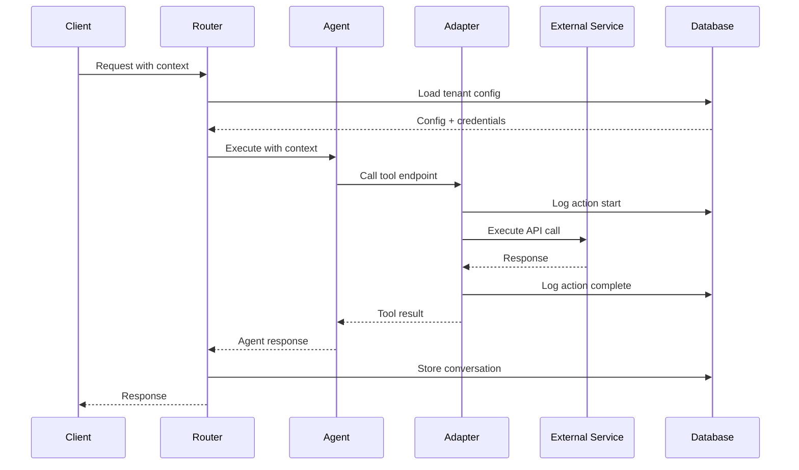

### Multi-Agent Workflow (Squad Pattern)

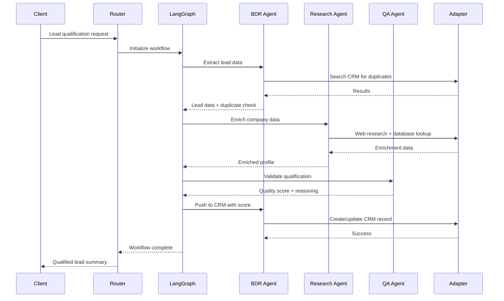

### Event-Driven Integration

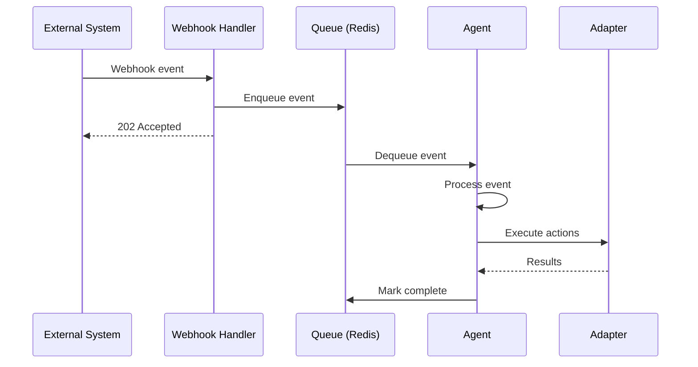

---

## Security Architecture

### Authentication & Authorization

#### Multi-Tenancy Model

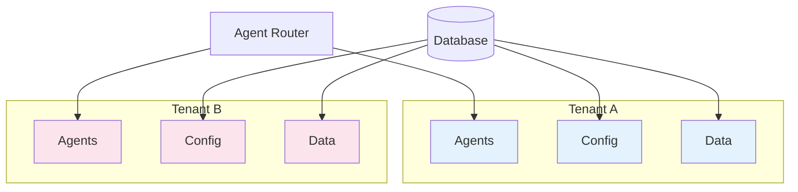

**Tenant Isolation**:
- Database: Row-level security with `tenant_id` column on all tables
- Compute: Namespace-based agent execution contexts
- Configuration: Encrypted tenant-specific credentials in vault
- Storage: Tenant-prefixed object keys in blob storage

#### Role-Based Access Control (RBAC)

**Role Hierarchy**:

```
Super Admin
  └── Tenant Admin
      ├── Operator
      │   └── Viewer
      └── Developer
          └── Viewer
```

**Permissions Matrix**:

| Action | Super Admin | Tenant Admin | Operator | Developer | Viewer |
|--------|------------|--------------|----------|-----------|--------|
| Create tenant | ✓ | ✗ | ✗ | ✗ | ✗ |
| Manage users | ✓ | ✓ | ✗ | ✗ | ✗ |
| Configure agents | ✓ | ✓ | ✓ | ✓ | ✗ |
| Execute workflows | ✓ | ✓ | ✓ | ✗ | ✗ |
| Approve actions | ✓ | ✓ | ✓ | ✗ | ✗ |
| View analytics | ✓ | ✓ | ✓ | ✓ | ✓ |
| Access code | ✓ | ✗ | ✗ | ✓ | ✗ |

### Audit Trail System

**Event Logging**:
- All agent actions logged with correlation IDs
- Immutable append-only audit log
- Retention: 90 days hot, 7 years cold storage (compliance)

**Audit Event Schema**:

```json
{
  "event_id": "evt_abc123",
  "correlation_id": "cor_xyz789",
  "tenant_id": "tenant_001",
  "timestamp": "2025-10-31T01:17:00Z",
  "actor": {
    "type": "agent|user",
    "id": "agent_bdr_001",
    "name": "BDR Concierge"
  },
  "action": "crm.note.create",
  "resource": {
    "type": "contact",
    "id": "cont_123"
  },
  "status": "success|failure",
  "metadata": {
    "ip_address": "192.168.1.1",
    "user_agent": "Transform-Army/1.0"
  },
  "changes": {
    "before": {},
    "after": {}
  }
}
```

### Data Security

**Encryption**:
- At rest: AES-256 encryption for database and file storage
- In transit: TLS 1.3 for all network communication
- Secrets: HashiCorp Vault or AWS Secrets Manager

**PII Handling**:
- Tokenization for sensitive fields (email, phone)
- Masking in logs and error messages
- Data retention policies per regulation (GDPR, CCPA)

**Compliance Controls**:
- SOC 2 Type II readiness
- GDPR data portability and deletion
- HIPAA compliance option for healthcare clients

---

## Integration Architecture

### External Service Integrations

#### Supported Providers (Phase 1-2)

**CRM Systems**:
- HubSpot (REST API + OAuth2)
- Salesforce (REST API + OAuth2)
- Pipedrive (REST API + API Key)

**Helpdesk Systems**:
- Zendesk (REST API + OAuth2)
- Intercom (REST API + API Key)
- Freshdesk (REST API + API Key)

**Calendar Systems**:
- Google Calendar (Calendar API + OAuth2)
- Microsoft Outlook (Graph API + OAuth2)

**Email Systems**:
- Gmail (Gmail API + OAuth2)
- Microsoft Outlook (Graph API + OAuth2)
- SendGrid (REST API + API Key)

**Productivity Tools**:
- Slack (Web API + OAuth2)
- Microsoft Teams (Graph API + OAuth2)
- Notion (REST API + OAuth2)

#### Provider Plugin Architecture

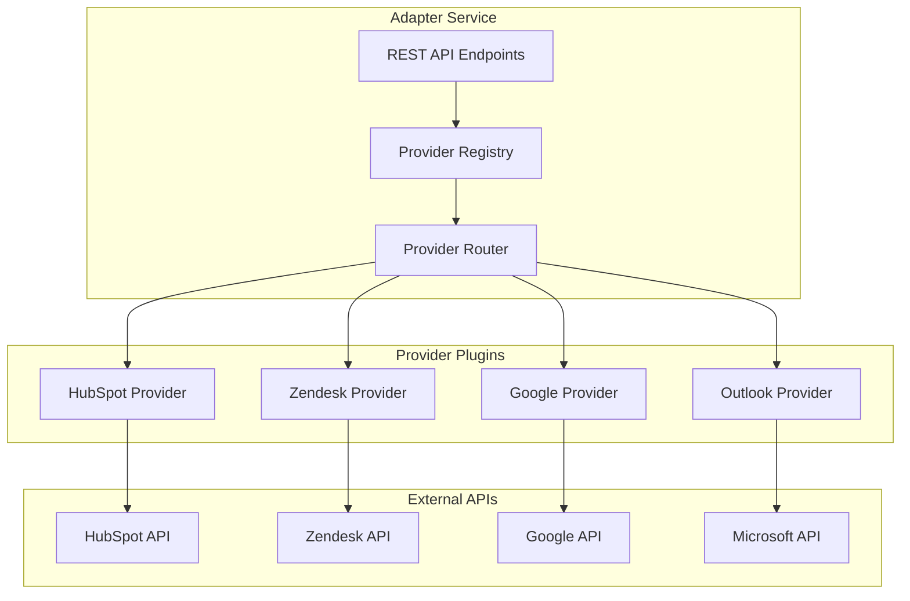

**Provider Interface Contract**:

```python
from abc import ABC, abstractmethod
from typing import Any, Dict

class ProviderPlugin(ABC):
    """Base interface for all provider plugins"""
    
    @abstractmethod
    async def validate_credentials(self, credentials: Dict[str, str]) -> bool:
        """Validate provider credentials"""
        pass
    
    @abstractmethod
    async def execute_action(
        self, 
        action: str, 
        parameters: Dict[str, Any],
        credentials: Dict[str, str]
    ) -> Dict[str, Any]:
        """Execute provider-specific action"""
        pass
    
    @abstractmethod
    def get_supported_actions(self) -> list[str]:
        """Return list of supported action types"""
        pass
```

### Integration Patterns

#### 1. Request-Response (Synchronous)

Used for: CRM updates, email sending, calendar booking

```
Client → Adapter → Provider → External API → Response
```

**Characteristics**:
- Immediate feedback required
- Timeout: 30 seconds
- Retry: 3 attempts with exponential backoff

#### 2. Webhook (Event-Driven)

Used for: New ticket notifications, calendar changes, CRM updates

```
External API → Webhook → Queue → Agent → Process
```

**Characteristics**:
- Asynchronous processing
- Idempotent handlers
- Replay capability for failed events

#### 3. Polling (Batch)

Used for: Data sync, report generation, bulk imports

```
Scheduler → Adapter → Provider → External API → Process Batch
```

**Characteristics**:
- Scheduled intervals (5min to 1hr)
- Rate limit aware
- Checkpoint-based resumption

---

## Migration Strategy

### Phase Transition Plan

#### Phase 1 → Phase 2: Adapter Introduction

**Timeline**: Week 5-6

**Steps**:
1. Deploy adapter service alongside Relevance
2. Update Relevance tool definitions to call adapter endpoints
3. Migrate one agent at a time (BDR first)
4. Validate functionality with A/B testing
5. Complete migration when confidence is high

**Rollback**: Keep direct Relevance tool integrations available for 2 weeks

#### Phase 2 → Phase 3: Orchestration Migration

**Timeline**: Week 13-16

**Steps**:
1. Deploy LangGraph orchestration service
2. Build state machine for one workflow (lead qualification)
3. Route 10% of traffic to new orchestration
4. Monitor metrics: latency, error rate, success rate
5. Gradually increase traffic: 25% → 50% → 100%
6. Deprecate Relevance workforce after 100% migration

**Rollback**: Feature flag to route back to Relevance workforce

#### Phase 3 → Phase 4: Complete Platform

**Timeline**: Month 7-9

**Steps**:
1. Launch custom chat widget (beta)
2. Offer existing clients choice of embed
3. Build SSO/SAML for enterprise clients
4. Offer VPC deployment option
5. Sunset Relevance embeds after all clients migrated

**Rollback**: Maintain Relevance embed option indefinitely for legacy clients

### Data Migration

**Approach**: Dual-write pattern during transition

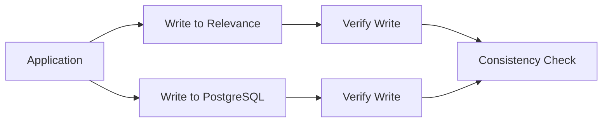

**Steps**:
1. **Preparation**: Schema mapping, data validation rules
2. **Dual Write**: Write to both systems during transition
3. **Validation**: Compare data between systems
4. **Cutover**: Stop reading from old system
5. **Cleanup**: Archive old system data after retention period

### Client Communication

**Migration Notice Timeline**:
- T-30 days: Migration announcement
- T-14 days: Detailed timeline and testing invitation
- T-7 days: Final reminder and support escalation
- T-Day: Execute migration
- T+1 day: Success confirmation and support follow-up

---

## Technology Stack

### Core Technologies

| Layer | Technology | Version | Justification |
|-------|-----------|---------|---------------|
| **Frontend** | Next.js | 14+ | App router, server components, edge runtime |
| **Backend** | FastAPI | 0.109+ | High performance, async, OpenAPI specs |
| **Orchestration** | LangGraph | 0.0.50+ | State machine for agent coordination |
| **Database** | PostgreSQL | 15+ | ACID compliance, JSONB, full-text search |
| **Vector DB** | Pinecone/Weaviate | Latest | Managed service, low latency, high recall |
| **Cache** | Redis | 7+ | Session management, rate limiting, queues |
| **Message Queue** | Redis Streams | 7+ | Event-driven workflows |
| **Object Storage** | S3/MinIO | Latest | Document storage, backups |

### Development Tools

| Tool | Purpose |
|------|---------|
| **pnpm** | Package management for monorepo |
| **Poetry** | Python dependency management |
| **Turborepo** | Monorepo build orchestration |
| **Docker Compose** | Local development environment |
| **Terraform** | Infrastructure as Code |
| **GitHub Actions** | CI/CD pipelines |

### Monitoring & Observability

| Tool | Purpose |
|------|---------|
| **OpenTelemetry** | Distributed tracing |
| **Prometheus** | Metrics collection |
| **Grafana** | Metrics visualization |
| **Sentry** | Error tracking |
| **DataDog/New Relic** | APM (production) |

---

## Quality Attributes

### Performance

**Targets**:
- API latency (p95): < 200ms
- Agent response time (p95): < 5 seconds
- Workflow completion (p95): < 30 seconds
- Database queries (p95): < 50ms

**Strategies**:
- Redis caching for frequently accessed data
- Database connection pooling
- Async I/O for external API calls
- CDN for static assets

### Scalability

**Horizontal Scaling**:
- Stateless adapter service (scale with load balancer)
- LangGraph workers (scale with message queue)
- Database read replicas for query scaling

**Capacity Planning**:
- Initial: 100 concurrent agents, 10K actions/day
- Growth: 1000 concurrent agents, 100K actions/day
- Enterprise: 10K concurrent agents, 1M actions/day

### Reliability

**SLA Targets**:
- Uptime: 99.9% (8.76 hours downtime/year)
- Data durability: 99.999999999% (11 nines)
- Recovery Time Objective (RTO): < 1 hour
- Recovery Point Objective (RPO): < 5 minutes

**Strategies**:
- Multi-AZ deployment for high availability
- Automated backups with point-in-time recovery
- Circuit breakers for external API calls
- Graceful degradation when services unavailable

### Maintainability

**Code Quality**:
- Test coverage: > 80%
- Type safety: TypeScript strict mode, Pydantic validation
- Linting: ESLint, Ruff, Prettier
- Documentation: OpenAPI specs, architecture diagrams

**DevOps**:
- Infrastructure as Code with Terraform
- GitOps workflows for deployments
- Automated testing in CI/CD
- Blue-green deployments for zero downtime

---

## Next Steps

1. **Review & Approval**: Stakeholder review of architecture
2. **Detailed Design**: Deep dive on adapter contracts and agent orchestration
3. **Prototype**: Build Phase 1 proof of concept
4. **Implementation Planning**: Sprint planning and resource allocation

---

## Appendix

### Glossary

- **Action**: A unit of work executed by an agent (billed unit)
- **Adapter**: Vendor-agnostic service layer for external integrations
- **Agent**: AI entity with specific role and capabilities
- **Squad**: Group of agents working together on a workflow
- **Workforce**: Complete set of agents in the system
- **Tool**: External capability available to agents (CRM, email, etc.)
- **Knowledge**: RAG-enabled document store for agent context
- **Correlation ID**: Unique identifier tracking request across services

### References

- [Relevance AI Documentation](https://relevanceai.com/docs)
- [LangGraph Documentation](https://langchain-ai.github.io/langgraph/)
- [FastAPI Documentation](https://fastapi.tiangolo.com/)
- [Next.js Documentation](https://nextjs.org/docs)

---

**Document Control**

| Version | Date | Author | Changes |
|---------|------|--------|---------|
| 1.0.0 | 2025-10-31 | Architecture Team | Initial architecture design |