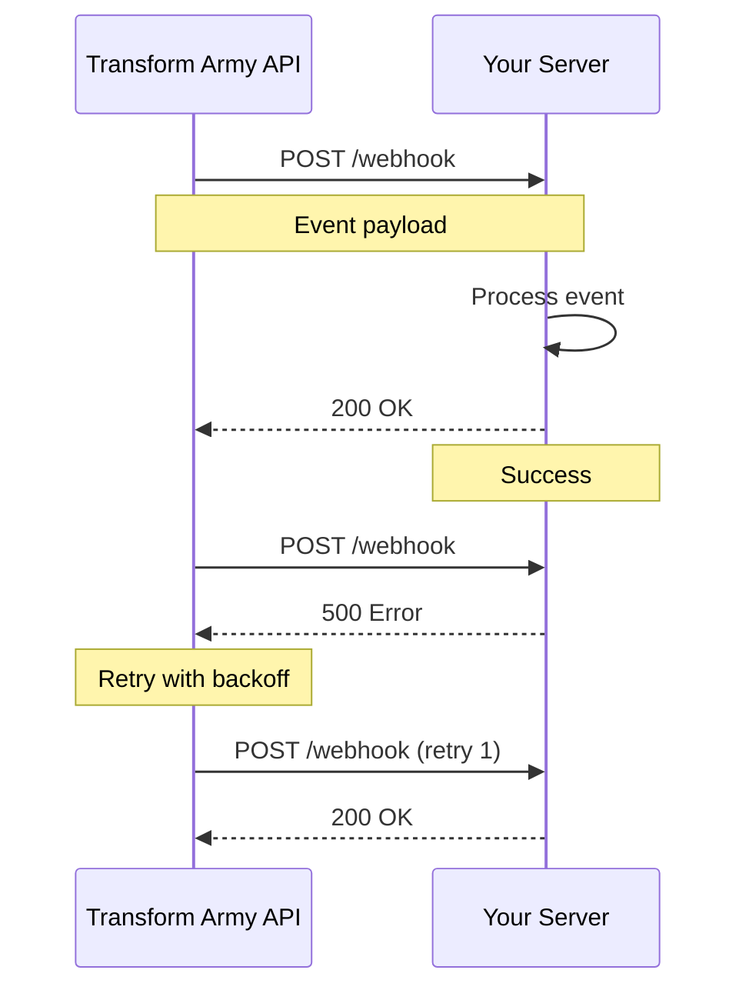

# Transform Army AI API Guide

> Comprehensive guide to integrating with the Transform Army AI Adapter Service

## Table of Contents

1. [Getting Started](#getting-started)
2. [Authentication](#authentication)
3. [Rate Limiting](#rate-limiting)
4. [Error Handling](#error-handling)
5. [Pagination](#pagination)
6. [Filtering and Sorting](#filtering-and-sorting)
7. [Idempotency](#idempotency)
8. [Webhooks](#webhooks)
9. [Code Examples](#code-examples)
10. [Best Practices](#best-practices)

---

## Getting Started

The Transform Army AI Adapter Service provides a vendor-agnostic API for integrating with CRM, Helpdesk, Calendar, Email, and Knowledge systems. This guide will help you integrate quickly and effectively.

### Base URLs

| Environment | URL | Description |
|------------|-----|-------------|
| Local | `http://localhost:8000` | Development server |
| Development | `https://api-dev.transform-army.ai` | Dev environment |
| Staging | `https://api-staging.transform-army.ai` | Staging environment |
| Production | `https://api.transform-army.ai` | Production environment |

### API Version

Current version: **v1**

All endpoints are prefixed with `/api/v1` (except health checks).

### Quick Start

```bash
# 1. Get your API key from the dashboard
export API_KEY="your_api_key_here"

# 2. Test the connection
curl -H "X-API-Key: $API_KEY" https://api.transform-army.ai/health/

# 3. Create your first contact
curl -X POST https://api.transform-army.ai/api/v1/crm/create_contact \
  -H "X-API-Key: $API_KEY" \
  -H "Content-Type: application/json" \
  -d '{
    "email": "john.doe@example.com",
    "first_name": "John",
    "last_name": "Doe",
    "company": "Acme Corp"
  }'
```

---

## Authentication

All API requests require authentication using an API key.

### Obtaining an API Key

1. Log in to your Transform Army AI dashboard
2. Navigate to **Settings** → **API Keys**
3. Click **Generate New Key**
4. Copy and securely store your key (it won't be shown again)

### Using API Keys

Include your API key in the `X-API-Key` header with every request:

```bash
curl -H "X-API-Key: your_api_key_here" https://api.transform-army.ai/api/v1/crm/contacts
```

### Multi-Tenant Authentication

If you're managing multiple tenants, include the tenant ID:

```bash
curl -H "X-API-Key: your_api_key_here" \
     -H "X-Tenant-ID: tenant_abc123" \
     https://api.transform-army.ai/api/v1/crm/contacts
```

> **Note**: The tenant ID can often be inferred from your API key, so this header is usually optional.

### Authentication Errors

| Status Code | Error Code | Description |
|------------|------------|-------------|
| 401 | `AUTHENTICATION_ERROR` | Missing or invalid API key |
| 403 | `FORBIDDEN` | API key doesn't have required permissions |

**Example Error Response:**
```json
{
  "error": {
    "code": "AUTHENTICATION_ERROR",
    "message": "Invalid API key",
    "correlation_id": "req_abc123",
    "timestamp": "2025-10-31T05:00:00Z"
  }
}
```

---

## Rate Limiting

Rate limits prevent abuse and ensure fair usage across all tenants.

### Limits

| Tier | Requests per Minute | Burst Allowance |
|------|---------------------|-----------------|
| Free | 60 | 10 |
| Professional | 300 | 50 |
| Enterprise | 1000+ | Custom |

### Rate Limit Headers

Every response includes rate limit information:

```http
X-RateLimit-Limit: 60
X-RateLimit-Remaining: 45
X-RateLimit-Reset: 1698739200
```

- `X-RateLimit-Limit`: Maximum requests allowed per window
- `X-RateLimit-Remaining`: Remaining requests in current window
- `X-RateLimit-Reset`: Unix timestamp when the limit resets

### Handling Rate Limits

When you exceed the rate limit, you'll receive a `429 Too Many Requests` response:

```json
{
  "error": {
    "code": "RATE_LIMIT_EXCEEDED",
    "message": "Rate limit exceeded. Try again in 30 seconds.",
    "retry_after": 30,
    "correlation_id": "req_xyz789",
    "timestamp": "2025-10-31T05:00:00Z"
  }
}
```

**Best Practices:**
1. Monitor `X-RateLimit-Remaining` header
2. Implement exponential backoff when rate limited
3. Cache responses when possible
4. Batch operations where supported

**Example: Python Rate Limit Handler**
```python
import time
import requests

def make_request_with_retry(url, headers, max_retries=3):
    for attempt in range(max_retries):
        response = requests.get(url, headers=headers)
        
        if response.status_code == 429:
            retry_after = int(response.headers.get('Retry-After', 60))
            print(f"Rate limited. Waiting {retry_after} seconds...")
            time.sleep(retry_after)
            continue
            
        return response
    
    raise Exception("Max retries exceeded")
```

---

## Error Handling

All errors return a consistent JSON structure with detailed information.

### Error Response Format

```json
{
  "error": {
    "code": "ERROR_CODE",
    "message": "Human-readable error message",
    "details": {
      "field": "email",
      "issue": "Invalid email format"
    },
    "correlation_id": "req_abc123",
    "timestamp": "2025-10-31T05:00:00Z"
  }
}
```

### Common Error Codes

| HTTP Status | Error Code | Description | Action |
|------------|------------|-------------|--------|
| 400 | `VALIDATION_ERROR` | Invalid request parameters | Check request body/parameters |
| 401 | `AUTHENTICATION_ERROR` | Missing/invalid API key | Verify API key |
| 403 | `FORBIDDEN` | Insufficient permissions | Check API key permissions |
| 404 | `NOT_FOUND` | Resource not found | Verify resource ID |
| 409 | `CONFLICT` | Resource already exists | Check for duplicates |
| 422 | `UNPROCESSABLE_ENTITY` | Invalid data format | Fix data format |
| 429 | `RATE_LIMIT_EXCEEDED` | Too many requests | Wait and retry |
| 500 | `INTERNAL_ERROR` | Server error | Contact support |
| 502 | `PROVIDER_ERROR` | External provider issue | Retry or contact support |
| 503 | `SERVICE_UNAVAILABLE` | Service temporarily down | Retry later |

### Validation Errors

Validation errors include detailed field-level information:

```json
{
  "error": {
    "code": "VALIDATION_ERROR",
    "message": "Request validation failed",
    "details": [
      {
        "field": "email",
        "issue": "field required",
        "type": "value_error.missing"
      },
      {
        "field": "phone",
        "issue": "string does not match regex",
        "type": "value_error.str.regex"
      }
    ],
    "correlation_id": "req_def456",
    "timestamp": "2025-10-31T05:00:00Z"
  }
}
```

### Correlation IDs

Every request is assigned a unique `correlation_id` for tracking:

```bash
curl -H "X-API-Key: $API_KEY" https://api.transform-army.ai/api/v1/crm/contacts

# Response includes correlation_id
{
  "id": "cont_123",
  "email": "john@example.com",
  ...
}

# Header: X-Correlation-ID: req_abc123
```

**Use correlation IDs when:**
- Reporting errors to support
- Debugging issues
- Tracing requests across systems

---

## Pagination

List endpoints return paginated results for better performance.

### Pagination Parameters

| Parameter | Type | Default | Description |
|-----------|------|---------|-------------|
| `limit` | integer | 10 | Number of items per page (max 100) |
| `offset` | integer | 0 | Number of items to skip |

### Pagination Response

```json
{
  "matches": [
    { "id": "cont_1", "email": "user1@example.com" },
    { "id": "cont_2", "email": "user2@example.com" }
  ],
  "pagination": {
    "page": 1,
    "page_size": 10,
    "total_pages": 5,
    "total_items": 47,
    "has_next": true,
    "has_previous": false,
    "next_cursor": null
  }
}
```

### Pagination Example

```bash
# Get first page
curl -H "X-API-Key: $API_KEY" \
  "https://api.transform-army.ai/api/v1/crm/search_contacts?limit=10&offset=0"

# Get second page
curl -H "X-API-Key: $API_KEY" \
  "https://api.transform-army.ai/api/v1/crm/search_contacts?limit=10&offset=10"

# Get third page
curl -H "X-API-Key: $API_KEY" \
  "https://api.transform-army.ai/api/v1/crm/search_contacts?limit=10&offset=20"
```

### Cursor-Based Pagination

Some endpoints support cursor-based pagination for better performance with large datasets:

```json
{
  "results": [...],
  "pagination": {
    "next_cursor": "eyJpZCI6MTIzfQ==",
    "has_next": true
  }
}
```

Use the `next_cursor` value in your next request:

```bash
curl -H "X-API-Key: $API_KEY" \
  "https://api.transform-army.ai/api/v1/logs?cursor=eyJpZCI6MTIzfQ=="
```

---

## Filtering and Sorting

### Filtering

Use the `filters` parameter to narrow results:

```bash
# Filter contacts by company
curl -X POST https://api.transform-army.ai/api/v1/crm/search_contacts \
  -H "X-API-Key: $API_KEY" \
  -H "Content-Type: application/json" \
  -d '{
    "query": "john",
    "filters": {
      "company": "Acme Corp",
      "created_after": "2025-01-01"
    },
    "limit": 20
  }'
```

### Common Filter Operators

| Operator | Example | Description |
|----------|---------|-------------|
| `eq` | `{"status": "active"}` | Equals |
| `ne` | `{"status__ne": "archived"}` | Not equals |
| `gt` | `{"created__gt": "2025-01-01"}` | Greater than |
| `gte` | `{"created__gte": "2025-01-01"}` | Greater than or equal |
| `lt` | `{"created__lt": "2025-12-31"}` | Less than |
| `lte` | `{"created__lte": "2025-12-31"}` | Less than or equal |
| `in` | `{"status__in": ["active", "pending"]}` | In list |
| `contains` | `{"name__contains": "john"}` | Contains substring |

### Sorting

Use the `sort` parameter to order results:

```bash
# Sort by created date (descending)
curl "https://api.transform-army.ai/api/v1/crm/contacts?sort=-created_at"

# Sort by name (ascending)
curl "https://api.transform-army.ai/api/v1/crm/contacts?sort=last_name"

# Multiple sort fields
curl "https://api.transform-army.ai/api/v1/crm/contacts?sort=company,-created_at"
```

- Prefix with `-` for descending order
- No prefix means ascending order
- Separate multiple fields with commas

---

## Idempotency

Idempotent operations can be safely retried without causing duplicate actions.

### How It Works

1. Generate a unique idempotency key (UUID recommended)
2. Include it in the `X-Idempotency-Key` header
3. Retry with the same key if request fails

### Example

```bash
# Generate idempotency key
IDEMPOTENCY_KEY=$(uuidgen)

# Make request with idempotency key
curl -X POST https://api.transform-army.ai/api/v1/crm/create_contact \
  -H "X-API-Key: $API_KEY" \
  -H "X-Idempotency-Key: $IDEMPOTENCY_KEY" \
  -H "Content-Type: application/json" \
  -d '{
    "email": "john.doe@example.com",
    "first_name": "John",
    "last_name": "Doe"
  }'

# If request fails, retry with same key
curl -X POST https://api.transform-army.ai/api/v1/crm/create_contact \
  -H "X-API-Key: $API_KEY" \
  -H "X-Idempotency-Key: $IDEMPOTENCY_KEY" \
  -H "Content-Type: application/json" \
  -d '{
    "email": "john.doe@example.com",
    "first_name": "John",
    "last_name": "Doe"
  }'
```

### Key Details

- **TTL**: Idempotency keys are valid for 24 hours
- **Scope**: Keys are scoped to tenant and endpoint
- **Response**: Cached response is returned for duplicate requests
- **Status**: Original status code is returned

### When to Use

✅ **Always use for:**
- Creating resources
- Sending emails
- Making payments
- Any mutation operation

❌ **Not needed for:**
- Read operations (GET requests)
- Health checks
- Search queries

---

## Webhooks

Webhooks allow you to receive real-time notifications of events.

### Webhook Flow



### Webhook Configuration

1. **Create webhook endpoint** in your application
2. **Register endpoint** in Transform Army dashboard
3. **Verify webhook signature** for security
4. **Return 200 OK** promptly

### Webhook Events

| Event Type | Description |
|-----------|-------------|
| `contact.created` | New contact created |
| `contact.updated` | Contact updated |
| `ticket.created` | New support ticket |
| `ticket.status_changed` | Ticket status changed |
| `workflow.completed` | Workflow execution completed |
| `workflow.failed` | Workflow execution failed |

### Webhook Payload

```json
{
  "event_id": "evt_abc123",
  "event_type": "contact.created",
  "timestamp": "2025-10-31T05:00:00Z",
  "tenant_id": "tenant_xyz",
  "data": {
    "id": "cont_123",
    "email": "john@example.com",
    "first_name": "John",
    "last_name": "Doe",
    "provider": "hubspot"
  },
  "signature": "sha256=abc123..."
}
```

### Verifying Webhook Signatures

**Python Example:**
```python
import hmac
import hashlib

def verify_webhook_signature(payload, signature, secret):
    """Verify webhook signature for security."""
    expected = hmac.new(
        secret.encode(),
        payload.encode(),
        hashlib.sha256
    ).hexdigest()
    
    provided = signature.split('=')[1]
    return hmac.compare_digest(expected, provided)

# Usage
@app.route('/webhook', methods=['POST'])
def webhook():
    signature = request.headers.get('X-Webhook-Signature')
    payload = request.get_data(as_text=True)
    
    if not verify_webhook_signature(payload, signature, WEBHOOK_SECRET):
        return 'Invalid signature', 401
    
    # Process event
    event = request.json
    print(f"Received event: {event['event_type']}")
    
    return '', 200
```

### Webhook Retry Logic

- **Initial attempt**: Immediate delivery
- **Retry 1**: After 1 minute if failed
- **Retry 2**: After 5 minutes if failed
- **Retry 3**: After 15 minutes if failed
- **Retry 4**: After 1 hour if failed
- **Retry 5**: After 6 hours if failed

After 5 failed attempts, the webhook is disabled and you'll receive an alert.

---

## Code Examples

### cURL

```bash
# Create a contact
curl -X POST https://api.transform-army.ai/api/v1/crm/create_contact \
  -H "X-API-Key: $API_KEY" \
  -H "Content-Type: application/json" \
  -d '{
    "email": "john.doe@example.com",
    "first_name": "John",
    "last_name": "Doe",
    "company": "Acme Corp",
    "phone": "+1-555-0123"
  }'

# Search contacts
curl -X POST https://api.transform-army.ai/api/v1/crm/search_contacts \
  -H "X-API-Key: $API_KEY" \
  -H "Content-Type: application/json" \
  -d '{
    "query": "john doe",
    "limit": 10
  }'

# Create support ticket
curl -X POST https://api.transform-army.ai/api/v1/helpdesk/tickets \
  -H "X-API-Key: $API_KEY" \
  -H "Content-Type: application/json" \
  -d '{
    "subject": "Integration help needed",
    "description": "Having issues with API integration",
    "priority": "high",
    "requester_email": "customer@example.com"
  }'
```

### Python

```python
import requests
import uuid

class TransformArmyClient:
    def __init__(self, api_key, base_url="https://api.transform-army.ai"):
        self.api_key = api_key
        self.base_url = base_url
        self.session = requests.Session()
        self.session.headers.update({
            "X-API-Key": api_key,
            "Content-Type": "application/json"
        })
    
    def create_contact(self, email, first_name=None, last_name=None, 
                      company=None, phone=None, idempotent=True):
        """Create a new CRM contact."""
        headers = {}
        if idempotent:
            headers["X-Idempotency-Key"] = str(uuid.uuid4())
        
        payload = {
            "email": email,
            "first_name": first_name,
            "last_name": last_name,
            "company": company,
            "phone": phone
        }
        
        response = self.session.post(
            f"{self.base_url}/api/v1/crm/create_contact",
            json=payload,
            headers=headers
        )
        response.raise_for_status()
        return response.json()
    
    def search_contacts(self, query=None, filters=None, limit=10, offset=0):
        """Search for CRM contacts."""
        payload = {
            "query": query,
            "filters": filters or {},
            "limit": limit,
            "offset": offset
        }
        
        response = self.session.post(
            f"{self.base_url}/api/v1/crm/search_contacts",
            json=payload
        )
        response.raise_for_status()
        return response.json()
    
    def create_ticket(self, subject, description, priority="normal", 
                     requester_email=None):
        """Create a support ticket."""
        payload = {
            "subject": subject,
            "description": description,
            "priority": priority,
            "requester_email": requester_email
        }
        
        response = self.session.post(
            f"{self.base_url}/api/v1/helpdesk/tickets",
            json=payload
        )
        response.raise_for_status()
        return response.json()

# Usage
client = TransformArmyClient(api_key="your_api_key")

# Create contact
contact = client.create_contact(
    email="john.doe@example.com",
    first_name="John",
    last_name="Doe",
    company="Acme Corp"
)
print(f"Created contact: {contact['id']}")

# Search contacts
results = client.search_contacts(query="john", limit=5)
print(f"Found {len(results['matches'])} contacts")

# Create ticket
ticket = client.create_ticket(
    subject="API Integration Help",
    description="Need help with rate limiting",
    priority="high",
    requester_email="customer@example.com"
)
print(f"Created ticket: {ticket['id']}")
```

### TypeScript

```typescript
import axios, { AxiosInstance } from 'axios';
import { v4 as uuidv4 } from 'uuid';

interface Contact {
  id: string;
  email: string;
  first_name?: string;
  last_name?: string;
  company?: string;
  phone?: string;
  provider?: string;
  created_at: string;
}

interface SearchContactsResponse {
  matches: Contact[];
  pagination: {
    page: number;
    page_size: number;
    total_pages: number;
    total_items: number;
    has_next: boolean;
    has_previous: boolean;
  };
}

class TransformArmyClient {
  private client: AxiosInstance;

  constructor(apiKey: string, baseURL: string = 'https://api.transform-army.ai') {
    this.client = axios.create({
      baseURL,
      headers: {
        'X-API-Key': apiKey,
        'Content-Type': 'application/json',
      },
    });
  }

  async createContact(
    email: string,
    options?: {
      first_name?: string;
      last_name?: string;
      company?: string;
      phone?: string;
      idempotent?: boolean;
    }
  ): Promise<Contact> {
    const headers: Record<string, string> = {};
    
    if (options?.idempotent !== false) {
      headers['X-Idempotency-Key'] = uuidv4();
    }

    const response = await this.client.post<Contact>(
      '/api/v1/crm/create_contact',
      {
        email,
        first_name: options?.first_name,
        last_name: options?.last_name,
        company: options?.company,
        phone: options?.phone,
      },
      { headers }
    );

    return response.data;
  }

  async searchContacts(
    query?: string,
    filters?: Record<string, any>,
    limit: number = 10,
    offset: number = 0
  ): Promise<SearchContactsResponse> {
    const response = await this.client.post<SearchContactsResponse>(
      '/api/v1/crm/search_contacts',
      {
        query,
        filters: filters || {},
        limit,
        offset,
      }
    );

    return response.data;
  }

  async createTicket(
    subject: string,
    description: string,
    options?: {
      priority?: 'low' | 'normal' | 'high' | 'urgent';
      requester_email?: string;
      tags?: string[];
    }
  ): Promise<any> {
    const response = await this.client.post('/api/v1/helpdesk/tickets', {
      subject,
      description,
      priority: options?.priority || 'normal',
      requester_email: options?.requester_email,
      tags: options?.tags || [],
    });

    return response.data;
  }
}

// Usage
const client = new TransformArmyClient('your_api_key');

// Create contact
const contact = await client.createContact('john.doe@example.com', {
  first_name: 'John',
  last_name: 'Doe',
  company: 'Acme Corp',
});
console.log(`Created contact: ${contact.id}`);

// Search contacts
const results = await client.searchContacts('john', {}, 5);
console.log(`Found ${results.matches.length} contacts`);

// Create ticket
const ticket = await client.createTicket(
  'API Integration Help',
  'Need help with rate limiting',
  {
    priority: 'high',
    requester_email: 'customer@example.com',
  }
);
console.log(`Created ticket: ${ticket.id}`);
```

### JavaScript (Node.js)

```javascript
const axios = require('axios');
const { v4: uuidv4 } = require('uuid');

class TransformArmyClient {
  constructor(apiKey, baseURL = 'https://api.transform-army.ai') {
    this.client = axios.create({
      baseURL,
      headers: {
        'X-API-Key': apiKey,
        'Content-Type': 'application/json',
      },
    });
  }

  async createContact(email, options = {}) {
    const headers = {};
    
    if (options.idempotent
 !== false) {
      headers['X-Idempotency-Key'] = uuidv4();
    }

    const response = await this.client.post('/api/v1/crm/create_contact', {
      email,
      first_name: options.first_name,
      last_name: options.last_name,
      company: options.company,
      phone: options.phone,
    }, { headers });

    return response.data;
  }

  async searchContacts(query, filters = {}, limit = 10, offset = 0) {
    const response = await this.client.post('/api/v1/crm/search_contacts', {
      query,
      filters,
      limit,
      offset,
    });

    return response.data;
  }

  async createTicket(subject, description, options = {}) {
    const response = await this.client.post('/api/v1/helpdesk/tickets', {
      subject,
      description,
      priority: options.priority || 'normal',
      requester_email: options.requester_email,
      tags: options.tags || [],
    });

    return response.data;
  }
}

// Usage
const client = new TransformArmyClient('your_api_key');

(async () => {
  // Create contact
  const contact = await client.createContact('john.doe@example.com', {
    first_name: 'John',
    last_name: 'Doe',
    company: 'Acme Corp',
  });
  console.log(`Created contact: ${contact.id}`);

  // Search contacts
  const results = await client.searchContacts('john', {}, 5);
  console.log(`Found ${results.matches.length} contacts`);

  // Create ticket
  const ticket = await client.createTicket(
    'API Integration Help',
    'Need help with rate limiting',
    {
      priority: 'high',
      requester_email: 'customer@example.com',
    }
  );
  console.log(`Created ticket: ${ticket.id}`);
})();
```

---

## Best Practices

### 1. Always Use HTTPS

Never send API keys over unencrypted connections:

```bash
# ✅ Good
curl https://api.transform-army.ai/api/v1/crm/contacts

# ❌ Bad
curl http://api.transform-army.ai/api/v1/crm/contacts
```

### 2. Store API Keys Securely

- Use environment variables, not hardcoded values
- Use secrets management (AWS Secrets Manager, HashiCorp Vault)
- Rotate keys regularly
- Never commit keys to version control

```python
# ✅ Good
import os
api_key = os.environ.get('TRANSFORM_ARMY_API_KEY')

# ❌ Bad
api_key = 'sk_live_abc123xyz789'
```

### 3. Implement Proper Error Handling

Always handle errors gracefully:

```python
try:
    contact = client.create_contact(email="john@example.com")
except requests.exceptions.HTTPError as e:
    if e.response.status_code == 429:
        # Rate limited - wait and retry
        time.sleep(60)
        contact = client.create_contact(email="john@example.com")
    elif e.response.status_code == 400:
        # Validation error - fix data
        error_details = e.response.json()
        print(f"Validation error: {error_details}")
    else:
        # Other errors - log and alert
        logger.error(f"API error: {e}")
        raise
```

### 4. Use Idempotency Keys

For all mutation operations:

```python
import uuid

def create_contact_safely(email, **kwargs):
    idempotency_key = str(uuid.uuid4())
    
    # Can retry safely if network fails
    for attempt in range(3):
        try:
            return client.create_contact(
                email=email,
                idempotency_key=idempotency_key,
                **kwargs
            )
        except NetworkError:
            if attempt < 2:
                time.sleep(2 ** attempt)
                continue
            raise
```

### 5. Implement Exponential Backoff

For retries:

```python
import time
import random

def exponential_backoff_retry(func, max_retries=5):
    for attempt in range(max_retries):
        try:
            return func()
        except Exception as e:
            if attempt == max_retries - 1:
                raise
            
            # Exponential backoff with jitter
            wait_time = (2 ** attempt) + random.uniform(0, 1)
            time.sleep(wait_time)
```

### 6. Monitor Rate Limits

Track your usage:

```python
def make_request_with_monitoring(url, headers):
    response = requests.get(url, headers=headers)
    
    # Log rate limit status
    remaining = response.headers.get('X-RateLimit-Remaining')
    limit = response.headers.get('X-RateLimit-Limit')
    
    usage_percent = (1 - int(remaining) / int(limit)) * 100
    
    if usage_percent > 80:
        logger.warning(f"Rate limit usage at {usage_percent:.1f}%")
    
    return response
```

### 7. Cache Responses

When appropriate:

```python
from functools import lru_cache
import time

@lru_cache(maxsize=100)
def get_contact_cached(contact_id, cache_time):
    """Cache contact lookups for 5 minutes."""
    return client.get_contact(contact_id)

# Usage - cache_time changes every 5 minutes
cache_key = int(time.time() / 300)
contact = get_contact_cached('cont_123', cache_key)
```

### 8. Use Batch Operations

When available:

```python
# ❌ Bad - Multiple requests
for email in emails:
    client.create_contact(email=email)

# ✅ Good - Batch request
client.create_contacts_batch(emails)
```

### 9. Validate Data Before Sending

Catch errors early:

```python
import re

def validate_contact_data(email, phone=None):
    """Validate contact data before API call."""
    # Email validation
    email_pattern = r'^[a-zA-Z0-9._%+-]+@[a-zA-Z0-9.-]+\.[a-zA-Z]{2,}$'
    if not re.match(email_pattern, email):
        raise ValueError(f"Invalid email: {email}")
    
    # Phone validation
    if phone:
        phone_pattern = r'^\+?1?\d{9,15}$'
        if not re.match(phone_pattern, phone.replace('-', '').replace(' ', '')):
            raise ValueError(f"Invalid phone: {phone}")
    
    return True

# Use before API call
validate_contact_data(email="john@example.com", phone="+1-555-0123")
contact = client.create_contact(email="john@example.com")
```

### 10. Log Correlation IDs

For debugging:

```python
import logging

logger = logging.getLogger(__name__)

def create_contact_with_logging(email, **kwargs):
    try:
        response = client.create_contact(email=email, **kwargs)
        
        # Log successful operation
        logger.info(
            f"Contact created: {response['id']}",
            extra={
                'correlation_id': response.get('correlation_id'),
                'email': email
            }
        )
        
        return response
        
    except Exception as e:
        # Log error with correlation ID
        correlation_id = getattr(e.response, 'headers', {}).get('X-Correlation-ID')
        logger.error(
            f"Failed to create contact: {e}",
            extra={
                'correlation_id': correlation_id,
                'email': email
            }
        )
        raise
```

---

## Additional Resources

- **API Reference**: Complete endpoint documentation with schemas
- **SDK Examples**: Language-specific SDK usage patterns
- **Webhooks Guide**: Detailed webhook configuration and handling
- **Error Codes**: Complete list of error codes and resolutions
- **Migration Guide**: Upgrading between API versions

---

## Support

Need help? We're here for you:

- 📧 **Email**: support@transform-army.ai
- 💬 **Chat**: Available in dashboard (Mon-Fri 9am-5pm EST)
- 📖 **Documentation**: https://docs.transform-army.ai
- 🐛 **Bug Reports**: https://github.com/transform-army-ai/platform/issues
- 💡 **Feature Requests**: https://feedback.transform-army.ai

**Emergency Support** (Enterprise plans): +1-555-TRANSFORM

---

*Last Updated: 2025-10-31* | *API Version: v1.0.0*