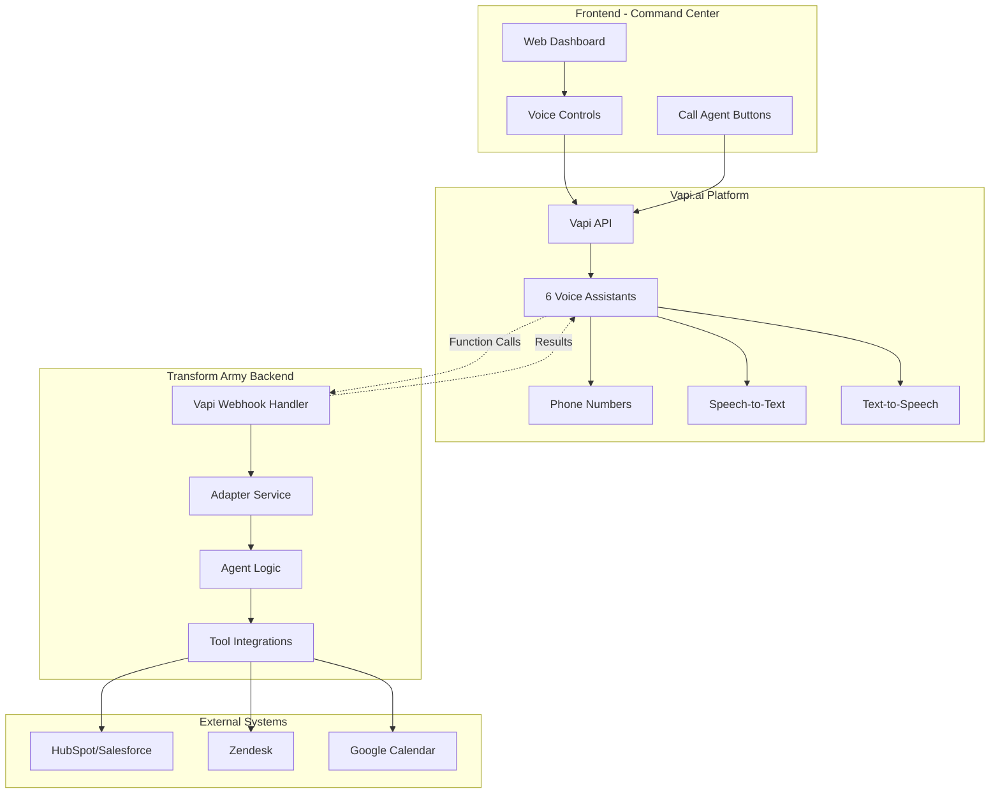

# Vapi.ai Voice Integration Architecture
**Transform Army AI - Voice Agent Implementation Plan**

**Version**: 1.0.0  
**Date**: 2025-11-01  
**Estimated Effort**: 5-7 days  
**Monthly Cost**: ~$75-150

---

## Executive Summary

This document outlines the architecture for integrating Vapi.ai voice capabilities into Transform Army AI, enabling your 6 existing text-based agents to conduct natural voice conversations. The integration leverages Vapi.ai's infrastructure while maintaining your existing adapter pattern and agent orchestration.

**Key Benefits**:
- ✅ Professional voice conversations without building telephony infrastructure
- ✅ Leverages existing agent logic and tools
- ✅ 5-7 day implementation timeline
- ✅ Predictable monthly costs ($75-150)
- ✅ Phone number provisioning included
- ✅ Built-in call recording and transcription

---

## Architecture Overview



---

## Vapi.ai vs Transform Army AI Agent Mapping

### Agent 1: BDR Concierge → "Hunter" Voice Assistant

**Vapi Configuration**:
```json
{
  "name": "Hunter - BDR Concierge",
  "voice": {
    "provider": "11labs",
    "voiceId": "professional_male_confident",
    "stability": 0.7,
    "similarity_boost": 0.8
  },
  "model": {
    "provider": "openai",
    "model": "gpt-4",
    "temperature": 0.3,
    "systemPrompt": "You are Hunter, call sign ALPHA-1, a Business Development Representative AI agent with the rank of Staff Sergeant. Your mission is to qualify inbound sales leads using the BANT framework (Budget, Authority, Need, Timeline). You are professional, confident, and focused on understanding the prospect's needs. You ask clear qualifying questions and book discovery meetings for qualified leads scoring 70+. Always maintain a consultative, helpful tone."
  },
  "functions": [
    {
      "name": "search_crm_contact",
      "description": "Search for existing contact in CRM by email or company",
      "parameters": {...}
    },
    {
      "name": "create_crm_contact",
      "description": "Create new contact in CRM with lead data",
      "parameters": {...}
    },
    {
      "name": "check_calendar_availability",
      "description": "Check sales team calendar for meeting availability",
      "parameters": {...}
    },
    {
      "name": "book_meeting",
      "description": "Book discovery meeting with qualified prospect",
      "parameters": {...}
    }
  ],
  "firstMessage": "This is Hunter from Transform Army AI. Thanks for reaching out! I'm here to learn about your business needs and see how we can help. To start, could you tell me a bit about what brought you to us today?",
  "endCallMessage": "Thanks for your time! You'll receive a confirmation email shortly with next steps. Looking forward to our meeting!",
  "serverUrl": "https://your-adapter-url.com/api/v1/vapi/webhook",
  "serverUrlSecret": "your-webhook-secret"
}
```

**Voice Persona**:
- **Tone**: Professional, confident, consultative
- **Pace**: Moderate (not rushed)
- **Style**: Business-appropriate but warm
- **Key Phrases**: "Let me check...", "That's helpful to know", "I'll connect you with..."

**Call Flow**:
1. Greeting → Establish rapport
2. Ask qualifying questions (BANT)
3. Call function to search CRM for duplicates
4. Assess qualification score
5. If qualified → Check calendar availability
6. Book meeting → Confirm details
7. Thank you → End call with next steps

---

### Agent 2: Support Concierge → "Medic" Voice Assistant

**Vapi Configuration**:
```json
{
  "name": "Medic - Support Concierge",
  "voice": {
    "provider": "11labs",
    "voiceId": "empathetic_female_calm",
    "stability": 0.8,
    "similarity_boost": 0.7
  },
  "model": {
    "provider": "openai",
    "model": "gpt-4",
    "temperature": 0.2,
    "systemPrompt": "You are Medic, call sign ALPHA-2, a Customer Support AI agent with the rank of Sergeant. Your mission is to triage support requests, provide knowledge-based solutions, and escalate complex issues with full context. You are empathetic, patient, and solution-focused. You search the knowledge base to provide accurate answers and escalate when human expertise is needed. Always maintain a helpful, caring tone."
  },
  "functions": [
    {
      "name": "search_knowledge_base",
      "description": "Search internal knowledge base for solutions",
      "parameters": {...}
    },
    {
      "name": "create_support_ticket",
      "description": "Create helpdesk ticket for the customer",
      "parameters": {...}
    },
    {
      "name": "search_past_tickets",
      "description": "Find similar past support tickets",
      "parameters": {...}
    },
    {
      "name": "escalate_to_human",
      "description": "Escalate complex issue to human support engineer",
      "parameters": {...}
    }
  ],
  "firstMessage": "Hi, this is Medic from Transform Army AI support. I'm here to help you today. Can you tell me what issue you're experiencing?",
  "endCallMessage": "Thanks for calling! You should receive a follow-up email shortly. If you need anything else, just reach out anytime!"
}
```

**Voice Persona**:
- **Tone**: Empathetic, patient, reassuring
- **Pace**: Deliberate (ensures understanding)
- **Style**: Helpful problem-solver
- **Key Phrases**: "I understand...", "Let me check that for you", "Here's what we can do..."

---

### Agents 3-6: Additional Voice Personalities

**Research Recon - "Scout"** (BRAVO-1):
- Voice: Analytical male, measured pace
- Tone: Inquisitive, methodical, data-driven
- Use Case: Competitive research calls, market intelligence gathering

**Ops Sapper - "Engineer"** (BRAVO-2):
- Voice: Authoritative male, steady pace
- Tone: Direct, efficient, no-nonsense
- Use Case: SLA alerts, operational notifications

**Knowledge Librarian - "Intel"** (CHARLIE-1):
- Voice: Clear female, teacher-like
- Tone: Educational, informative, organized
- Use Case: KB article creation consultation, documentation reviews

**QA Auditor - "Guardian"** (CHARLIE-2):
- Voice: Precise male, deliberate  
- Tone: Thorough, detail-oriented, fair
- Use Case: Quality feedback calls, audit discussions

---

## Integration Architecture

### Phase 1: Backend Vapi Webhook Handler

**Create new API routes** in adapter service:

```python
# apps/adapter/src/api/vapi.py

from fastapi import APIRouter, Request, Header
from typing import Dict, Any
import hmac
import hashlib

router = APIRouter()

@router.post("/webhook")
async def vapi_webhook(
    request: Request,
    x_vapi_signature: str = Header(None)
):
    """
    Handle Vapi.ai webhook events including:
    - function-call: Agent needs to execute a tool
    - call-started: Conversation begins
    - call-ended: Conversation ends
    - transcript: Real-time transcript updates
    """
    # Verify webhook signature
    body = await request.body()
    verify_vapi_signature(body, x_vapi_signature)
    
    payload = await request.json()
    event_type = payload.get("message", {}).get("type")
    
    if event_type == "function-call":
        return await handle_function_call(payload)
    elif event_type == "call-ended":
        return await handle_call_ended(payload)
    
    return {"status": "acknowledged"}

async def handle_function_call(payload: Dict[str, Any]):
    """
    Execute tool requested by Vapi assistant.
    Maps to your existing adapter tools.
    """
    function_name = payload["functionCall"]["name"]
    parameters = payload["functionCall"]["parameters"]
    
    # Route to appropriate provider
    if function_name.startswith("crm_"):
        result = await execute_crm_tool(function_name, parameters)
    elif function_name.startswith("helpdesk_"):
        result = await execute_helpdesk_tool(function_name, parameters)
    elif function_name.startswith("calendar_"):
        result = await execute_calendar_tool(function_name, parameters)
    
    return {
        "result": result,
        "metadata": {
            "timestamp": datetime.utcnow().isoformat(),
            "agent": payload.get("call", {}).get("assistantId")
        }
    }
```

**Add to** [`main_simple.py`](apps/adapter/src/main_simple.py:1):

```python
# Vapi webhook endpoints
@app.post("/api/v1/vapi/webhook")
async def vapi_webhook(request: Request):
    """Handle Vapi.ai function calls and events"""
    payload = await request.json()
    message_type = payload.get("message", {}).get("type")
    
    if message_type == "function-call":
        function_name = payload["functionCall"]["name"]
        parameters = payload["functionCall"]["parameters"]
        
        # Map to existing tools
        if function_name == "search_crm_contact":
            result = await search_contacts(parameters.get("query"))
        elif function_name == "create_crm_contact":
            result = await create_contact(parameters)
        elif function_name == "book_meeting":
            result = await book_calendar_event(parameters)
        
        return {"result": result}
    
    return {"status": "ok"}

@app.post("/api/v1/vapi/calls/log")
async def log_vapi_call(call_data: dict):
    """Log completed Vapi calls to activity logs"""
    # Store call transcript, duration, outcome
    return {"logged": True}
```

---

### Phase 2: Frontend Voice UI Components

**Component 1: Voice Call Button**

Create `apps/web/src/components/voice-call-button.tsx`:

```typescript
'use client'

import { useState } from 'react'
import { Button } from '@/components/ui/button'
import { Badge } from '@/components/ui/badge'

interface VoiceCallButtonProps {
  agentId: string
  agentName: string
  callSign: string
  vapiAssistantId: string
}

export function VoiceCallButton({ agentId, agentName, callSign, vapiAssistantId }: VoiceCallButtonProps) {
  const [isCallActive, setIsCallActive] = useState(false)
  const [callDuration, setCallDuration] = useState(0)
  
  const startCall = async () => {
    // Initialize Vapi SDK
    const vapi = new Vapi('your-public-key')
    
    // Start call with specific assistant
    await vapi.start(vapiAssistantId)
    setIsCallActive(true)
    
    // Listen for call events
    vapi.on('call-end', () => {
      setIsCallActive(false)
      // Log call to backend
      logCall()
    })
  }
  
  return (
    <div className="flex items-center gap-2">
      <Button
        onClick={startCall}
        disabled={isCallActive}
        className="bg-tactical-green hover:bg-tactical-green/80"
      >
        {isCallActive ? '📞 In Call...' : '📞 Call ' + callSign}
      </Button>
      
      {isCallActive && (
        <Badge variant="outline" className="animate-pulse">
          <span className="mr-1">●</span>
          LIVE {formatDuration(callDuration)}
        </Badge>
      )}
    </div>
  )
}
```

**Component 2: Voice Assistant Widget**

Create `apps/web/src/components/vapi-widget.tsx`:

```typescript
'use client'

import { useEffect } from 'react'
import Vapi from '@vapi-ai/web'

export function VapiWidget() {
  useEffect(() => {
    const vapi = new Vapi('your-public-key')
    
    // Global voice assistant button (bottom-right)
    vapi.on('call-start', () => console.log('Call started'))
    vapi.on('call-end', () => console.log('Call ended'))
    vapi.on('speech-start', () => console.log('User speaking'))
    vapi.on('speech-end', () => console.log('User stopped'))
    
    return () => vapi.stop()
  }, [])
  
  return (
    <div className="fixed bottom-4 right-4 z-50">
      {/* Vapi floating button renders here */}
    </div>
  )
}
```

---

## Agent-to-Voice Mapping

### 1.  BDR Concierge (Hunter - ALPHA-1)

**Primary Use Case**: Inbound sales inquiry calls

**Voice Configuration**:
- Provider: ElevenLabs
- Voice: `professional_male_confident` (Josh or similar)
- Accent: American, neutral
- Age: 30-40 range
- Tempo: Moderate, clear

**System Prompt**:
```
You are Hunter, call sign ALPHA-1, a Business Development Representative AI agent with the rank of Staff Sergeant in the Transform Army AI squadron. 

Your mission is to qualify inbound sales leads using the BANT framework:
- Budget (30 points): Funding availability and amount
- Authority (25 points): Decision-making power
- Need (30 points): Business problem and product fit
- Timeline (15 points): Project urgency and timeline

Call Flow:
1. Greet caller warmly and establish rapport
2. Ask open-ended question about their needs
3. Listen actively and ask BANT qualifying questions naturally in conversation
4. Score each dimension based on responses
5. If total score ≥70: Offer to book a discovery meeting
6. If score <70: Offer to send information and follow up later

Tools Available:
- search_crm_contact: Check if they're already in system
- create_crm_contact: Create new contact record
- check_calendar_availability: See when sales team is free
- book_meeting: Schedule discovery call

Personality:
- Professional but friendly
- Confident and knowledgeable
- Good listener, asks clarifying questions
- Solution-oriented, not pushy
- Uses military precision in communication

Always:
- Confirm you understood their needs correctly
- Explain next steps clearly
- Provide timeline expectations
- Thank them for their time
```

**Function Definitions**:
```json
[
  {
    "name": "search_crm_contact",
    "description": "Search CRM for existing contact to prevent duplicates",
    "parameters": {
      "type": "object",
      "properties": {
        "email": {"type": "string", "description": "Contact email address"},
        "company": {"type": "string", "description": "Company name"}
      },
      "required": ["email"]
    }
  },
  {
    "name": "create_crm_contact",
    "description": "Create new contact in CRM with qualification data",
    "parameters": {
      "type": "object",
      "properties": {
        "email": {"type": "string"},
        "first_name": {"type": "string"},
        "last_name": {"type": "string"},
        "company": {"type": "string"},
        "phone": {"type": "string"},
        "budget_score": {"type": "number"},
        "authority_score": {"type": "number"},
        "need_score": {"type": "number"},
        "timeline_score": {"type": "number"},
        "total_score": {"type": "number"},
        "notes": {"type": "string"}
      },
      "required": ["email", "first_name", "last_name", "company", "total_score"]
    }
  },
  {
    "name": "book_meeting",
    "description": "Book discovery meeting if lead is qualified (score ≥70)",
    "parameters": {
      "type": "object",
      "properties": {
        "contact_email": {"type": "string"},
        "preferred_date": {"type": "string"},
        "preferred_time": {"type": "string"},
        "duration_minutes": {"type": "number", "default": 30}
      },
      "required": ["contact_email", "preferred_date", "preferred_time"]
    }
  }
]
```

---

### 2. Support Concierge (Medic - ALPHA-2)

**Primary Use Case**: Customer support help line

**Voice Configuration**:
- Voice: `empathetic_female_calm` (Bella or Rachel)
- Tone: Warm, patient, reassuring
- Pace: Slower for technical instructions

**System Prompt**:
```
You are Medic, call sign ALPHA-2, a Customer Support AI agent with the rank of Sergeant in Transform Army AI. 

Your mission is to triage support requests, provide knowledge-based solutions, and escalate complex issues to human engineers.

Call Flow:
1. Greet customer warmly and acknowledge their issue
2. Classify issue priority (P1-P4) and category
3. Search knowledge base for solutions
4. If KB match >80% confidence: Guide through solution steps
5. If KB match <70%: Gather details and escalate to human
6. Verify solution resolved the issue
7. Create support ticket with conversation summary

Tools Available:
- search_knowledge_base: Find documented solutions
- create_support_ticket: Create ticket in helpdesk
- search_past_tickets: Find similar historical issues
- escalate_to_human: Route to support engineer with context

Personality:
- Empathetic and understanding
- Patient with non-technical users
- Clear in explaining technical concepts
- Proactive in offering help
- Reassuring during stressful situations

Always:
- Acknowledge the customer's frustration or concern
- Explain what you're doing and why
- Confirm understanding before moving to next step
- Verify solution resolved the issue
- Provide ticket reference number
```

---

### 3-6. Additional Agent Mappings

**Research Recon (Scout - BRAVO-1)**:
- Voice: Analytical male, methodical
- Use Case: Research consultation calls, competitive intel briefings

**Ops Sapper (Engineer - BRAVO-2)**:
- Voice: Authoritative male, direct
- Use Case: SLA alert notifications, system status briefings

**Knowledge Librarian (Intel - CHARLIE-1)**:
- Voice: Clear female, educational
- Use Case: Documentation consultation, KB article creation

**QA Auditor (Guardian - CHARLIE-2)**:
- Voice: Precise male, professional
- Use Case: Quality feedback sessions, audit reviews

---

## Backend Integration Points

### API Endpoints to Add

```python
# apps/adapter/src/api/vapi.py (NEW FILE)

from fastapi import APIRouter, Request, HTTPException, Header
from pydantic import BaseModel
from typing import Dict, Any, Optional
import hmac
import hashlib
from datetime import datetime

router = APIRouter()

class VapiFunctionCall(BaseModel):
    """Vapi function call request"""
    call_id: str
    assistant_id: str
    function_name: str
    parameters: Dict[str, Any]

class VapiCallLog(BaseModel):
    """Vapi call completion log"""
    call_id: str
    assistant_id: str
    duration_seconds: int
    transcript: str
    summary: Optional[str]
    outcome: str

@router.post("/webhook")
async def vapi_webhook(
    request: Request,
    x_vapi_signature: str = Header(None)
):
    """
    Main webhook endpoint for Vapi.ai events.
    Handles function calls, transcripts, and call lifecycle events.
    """
    # Verify signature
    body = await request.body()
    expected_sig = hmac.new(
        VAPI_WEBHOOK_SECRET.encode(),
        body,
        hashlib.sha256
    ).hexdigest()
    
    if not hmac.compare_digest(expected_sig, x_vapi_signature):
        raise HTTPException(401, "Invalid signature")
    
    payload = await request.json()
    message = payload.get("message", {})
    message_type = message.get("type")
    
    # Route based on event type
    if message_type == "function-call":
        return await handle_function_call(payload)
    elif message_type == "call-started":
        return await log_call_start(payload)
    elif message_type == "call-ended":
        return await log_call_end(payload)
    elif message_type == "transcript":
        return await stream_transcript(payload)
    
    return {"status": "ok"}

async def handle_function_call(payload: Dict[str, Any]) -> Dict[str, Any]:
    """
    Execute tool function requested by voice assistant.
    Maps Vapi function calls to Transform Army adapter tools.
    """
    function_call = payload["message"]["functionCall"]
    function_name = function_call["name"]
    parameters = function_call["parameters"]
    call_id = payload["message"]["call"]["id"]
    assistant_id = payload["message"]["call"]["assistant"]["id"]
    
    # Log the function call
    logger.info(f"Vapi function call: {function_name}", extra={
        "call_id": call_id,
        "assistant_id": assistant_id,
        "parameters": parameters
    })
    
    # Route to existing adapter tools
    try:
        if function_name == "search_crm_contact":
            result = await crm_provider.search_contacts(
                query=parameters.get("email"),
                limit=1
            )
        elif function_name == "create_crm_contact":
            result = await crm_provider.create_contact(
                email=parameters["email"],
                first_name=parameters.get("first_name"),
                last_name=parameters.get("last_name"),
                company=parameters.get("company"),
                metadata={
                    "qualification_score": parameters.get("total_score"),
                    "bant_scores": {
                        "budget": parameters.get("budget_score"),
                        "authority": parameters.get("authority_score"),
                        "need": parameters.get("need_score"),
                        "timeline": parameters.get("timeline_score")
                    },
                    "source": "vapi_voice_call",
                    "call_id": call_id
                }
            )
        elif function_name == "book_meeting":
            result = await calendar_provider.create_event(
                calendar_id="sales_team",
                summary=f"Discovery Call - {parameters.get('company_name', 'Prospect')}",
                start_time=parameters["preferred_date"] + "T" + parameters["preferred_time"],
                duration_minutes=parameters.get("duration_minutes", 30),
                attendees=[parameters["contact_email"], "sales@yourcompany.com"]
            )
        elif function_name == "search_knowledge_base":
            result = await knowledge_provider.search(
                query=parameters["query"],
                limit=3
            )
        elif function_name == "create_support_ticket":
            result = await helpdesk_provider.create_ticket(
                subject=parameters["subject"],
                description=parameters["description"],
                priority=parameters.get("priority", "normal"),
                requester_email=parameters.get("customer_email")
            )
        
        return {"result": result}
        
    except Exception as e:
        logger.error(f"Function call failed: {str(e)}", extra={
            "function": function_name,
            "call_id": call_id
        })
        return {
            "error": str(e),
            "message": "I encountered an issue. Let me escalate this to my team."
        }

async def log_call_end(payload: Dict[str, Any]) -> Dict[str, Any]:
    """
    Log completed call to activity logs for tracking.
    Store transcript, summary, and outcome.
    """
    call = payload["message"]["call"]
    
    call_log = {
        "id": str(uuid.uuid4()),
        "call_id": call["id"],
        "assistant_id": call["assistant"]["id"],
        "assistant_name": call["assistant"]["name"],
        "duration_seconds": call.get("durationSeconds", 0),
        "cost": call.get("cost", 0),
        "ended_reason": call.get("endedReason"),
        "transcript": call.get("transcript", ""),
        "summary": call.get("summary", ""),
        "created_at": datetime.utcnow().isoformat() + "Z"
    }
    
    # Store in activity logs
    activity_logs.append(call_log)
    
    return {"logged": True}
```

---

## Frontend Implementation

### Update Agent Cards with Voice Buttons

**Modify** [`apps/web/src/app/agents/page.tsx`](apps/web/src/app/agents/page.tsx:1):

Add call buttons to each agent card:

```typescript
import { VoiceCallButton } from '@/components/voice-call-button'

// In agent card rendering:
<div className="flex gap-2 mt-4">
  <VoiceCallButton
    agentId={agent.id}
    agentName={agent.name}
    callSign={agent.call_sign}
    vapiAssistantId={agent.vapi_assistant_id}
  />
  <Button variant="outline">View Details</Button>
  <Button variant="outline">Configure</Button>
</div>
```

### Add Voice Widget to Layout

**Modify** [`apps/web/src/app/layout.tsx`](apps/web/src/app/layout.tsx:1):

```typescript
import { VapiWidget } from '@/components/vapi-widget'

export default function RootLayout({ children }: { children: React.ReactNode }) {
  return (
    <html lang="en">
      <head>
        <script src="https://cdn.jsdelivr.net/npm/@vapi-ai/web@latest/dist/index.js"></script>
      </head>
      <body>
        {children}
        <VapiWidget />
      </body>
    </html>
  )
}
```

---

## Implementation Roadmap

### **Week 1: Foundation (Days 1-3)**

**Day 1: Vapi Account Setup**
- [ ] Sign up for Vapi.ai account
- [ ] Get API keys (public + private)
- [ ] Provision 1-2 phone numbers
- [ ] Configure webhook URL
- [ ] Set up billing and alerts

**Day 2: Backend Webhook Integration**
- [ ] Create `/api/v1/vapi/webhook` endpoint
- [ ] Implement signature verification
- [ ] Add function call routing
- [ ] Test with Vapi dashboard
- [ ] Add call logging endpoints

**Day 3: First Voice Assistant (BDR)**
- [ ] Create "Hunter" assistant in Vapi
- [ ] Configure voice and model
- [ ] Add system prompt from agent configs
- [ ] Define 3-4 core functions
- [ ] Test inbound call flow
- [ ] Verify tool execution works

### **Week 2: Full Deployment (Days 4-7)**

**Day 4: Support Assistant**
- [ ] Create "Medic" assistant
- [ ] KB search function integration
- [ ] Ticket creation workflows
- [ ] Test support call scenarios

**Day 5: Research & Ops Assistants**
- [ ] Create "Scout" assistant (research)  
- [ ] Create "Engineer" assistant (ops)
- [ ] Configure specialized functions
- [ ] Test edge cases

**Day 6: Knowledge & QA Assistants**
- [ ] Create "Intel" assistant (knowledge)
- [ ] Create "Guardian" assistant (QA)
- [ ] Finalize all 6 voice personalities
- [ ] Cross-agent testing

**Day 7: Frontend Integration & Testing**
- [ ] Add call buttons to each agent card
- [ ] Implement call status indicators
- [ ] Add call history view
- [ ] End-to-end testing
- [ ] Document all features
- [ ] Deploy to production

---

## Technical Requirements

### Dependencies to Add

**Frontend** (`apps/web/package.json`):
```json
{
  "dependencies": {
    "@vapi-ai/web": "^2.0.0",
    "@vapi-ai/react": "^1.0.0"
  }
}
```

**Backend** (`apps/adapter/requirements.txt`):
```
vapi-python>=0.1.0  # Official Vapi SDK (if available)
pydantic>=2.0.0     # Already installed
cryptography>=41.0.0  # For webhook signature verification
```

### Environment Variables

**Add to** [`apps/adapter/.env`](apps/adapter/.env:1):
```bash
# Vapi.ai Configuration
VAPI_PUBLIC_KEY=your_public_key_here
VAPI_PRIVATE_KEY=your_private_key_here
VAPI_WEBHOOK_SECRET=your_webhook_secret_here

# Vapi Assistant IDs (after creation)
VAPI_ASSISTANT_BDR=asst_xxx
VAPI_ASSISTANT_SUPPORT=asst_yyy
VAPI_ASSISTANT_RESEARCH=asst_zzz
VAPI_ASSISTANT_OPS=asst_aaa
VAPI_ASSISTANT_KNOWLEDGE=asst_bbb
VAPI_ASSISTANT_QA=asst_ccc
```

**Add to** [`apps/web/.env`](apps/web/.env:1):
```bash
NEXT_PUBLIC_VAPI_PUBLIC_KEY=your_public_key_here
NEXT_PUBLIC_VAPI_ORG_ID=your_org_id_here
```

---

## Call Flows & User Journeys

### Journey 1: Prospect Calls Hunter (BDR)

```
1. Prospect dials: (555) 123-4567
2. Vapi answers: "This is Hunter from Transform Army AI..."
3. Hunter asks qualifying questions naturally
4. Prospect provides: Budget info, role, needs, timeline
5. Hunter calls functions:
   - search_crm_contact(email="john@acme.com")
   - create_crm_contact(data={...}) [if new]
6. Hunter calculates BANT: 85/100
7. Hunter: "Great! You qualify for our discovery process..."
8. Hunter calls: check_calendar_availability()
9. Hunter: "I have Tuesday at 2pm or Wednesday at 10am..."
10. Prospect chooses: Tuesday at 2pm
11. Hunter calls: book_meeting(date="2025-11-05", time="14:00")
12. Hunter: "Perfect! You'll receive a calendar invite shortly..."
13. Call ends, confirmation email sent automatically
```

### Journey 2: Customer Calls Medic (Support)

```
1. Customer dials support number
2. Vapi answers: "Hi, this is Medic from Transform Army AI support..."
3. Customer describes: "I can't log in to my account"
4. Medic assesses: P2 priority, Authentication category
5. Medic calls: search_knowledge_base(query="password reset login issue")
6. KB returns: Article on password reset (confidence: 0.95)
7. Medic: "I found the solution! Here are the steps..."
8. Guides customer through password reset
9. Customer: "That worked! Thank you!"
10. Medic calls: create_support_ticket(status="resolved")
11. Medic: "Great! Your ticket reference is SUP-12345..."
12. Call ends, follow-up email sent
```

---

## Cost Analysis

### Vapi.ai Pricing

**Monthly Subscription**:
- Hobby Plan: $49/month (500 minutes included)
- Growth Plan: $149/month (2500 minutes included)
- Business Plan: $499/month (10,000 minutes included)

**Usage Costs** (after included minutes):
- Voice calls: ~$0.05-0.10 per minute
- Phone numbers: $2-5/month per number
- SMS: $0.01 per message

### Estimated Monthly Costs

**Scenario 1: Low Volume** (100 calls/month, 5 min avg)
- Subscription: $49/month (Hobby)
- Usage: 500 minutes included (✓)
- Phone numbers (2): $10/month
- **Total: ~$59/month**

**Scenario 2: Medium Volume** (500 calls/month, 5 min avg)
- Subscription: $149/month (Growth)
- Usage: 2500 minutes included (✓)
- Phone numbers (6): $30/month
- **Total: ~$179/month**

**Scenario 3: High Volume** (2000 calls/month, 5 min avg)
- Subscription: $499/month (Business)
- Usage: 10,000 minutes included (✓)
- Phone numbers (6): $30/month
- **Total: ~$529/month**

### ROI Calculation

**Cost Savings vs Human Agents**:
- Human BDR: ~$60K/year + benefits
- Hunter AI: ~$2,160/year (Growth plan)
- **Savings: ~$57,840 per BDR replaced**

**Support Cost Comparison**:
- Human Tier 1 agent: ~$45K/year
- Medic AI: ~$2,160/year
- **Savings: ~$42,840 per support agent**

---

## Security & Compliance

### Webhook Security

```python
def verify_vapi_signature(body: bytes, signature: str) -> bool:
    """Verify Vapi webhook signature"""
    expected = hmac.new(
        settings.vapi_webhook_secret.encode(),
        body,
        hashlib.sha256
    ).hexdigest()
    
    return hmac.compare_digest(expected, signature)
```

### PII Handling

- **Call Recordings**: Store encrypted, delete after 90 days
- **Transcripts**: Redact PII before logging
- **Phone Numbers**: Mask in logs (XXX-XXX-1234)
- **GDPR**: Provide deletion endpoint for call data

### Compliance Requirements

- **TCPA**: Obtain consent before outbound calls
- **CCPA/GDPR**: Honor data deletion requests
- **Call Recording**: Announce recording at call start
- **Consent**: "This call may be recorded for quality assurance"

---

## Testing Strategy

### Unit Tests

```python
def test_vapi_webhook_function_call():
    """Test function call routing"""
    payload = {
        "message": {
            "type": "function-call",
            "functionCall": {
                "name": "search_crm_contact",
                "parameters": {"email": "test@example.com"}
            }
        }
    }
    response = vapi_webhook(payload)
    assert response["result"] is not None

def test_signature_verification():
    """Test webhook signature verification"""
    body = b'{"message": {"type": "function-call"}}'
    signature = generate_signature(body)
    assert verify_vapi_signature(body, signature) == True
```

### Integration Tests

1. **Inbound Call Test**:
   - Dial test number
   - Speak qualifying questions
   - Verify function calls execute
   - Check CRM record created
   - Confirm meeting booked

2. **Outbound Call Test**:
   - Trigger call via API
   - Verify Vapi initiates call
   - Check conversation flow
   - Validate call logging

3. **Error Handling Test**:
   - Simulate tool failures
   - Test escalation triggers
   - Verify graceful degradation

---

## Monitoring & Analytics

### Call Metrics to Track

```typescript
interface CallMetrics {
  total_calls: number
  avg_duration_seconds: number
  successful_calls: number
  failed_calls: number
  escalation_rate: number
  function_calls_per_call: number
  by_agent: {
    [agent_id: string]: {
      call_count: number
      avg_duration: number
      success_rate: number
      qualification_rate: number  // For BDR
      deflection_rate: number    // For Support
    }
  }
}
```

### Dashboard Additions

Add to homepage statistics:
- **Voice Call Volume**: Total calls this month
- **Avg Call Duration**: 4.5 minutes
- **Voice Deflection Rate**: 45% (for support)
- **Meeting Booking Rate**: 65% (for BDR)

---

## Migration Path

### Phase 1: Parallel Operation (Week 1-2)
- Voice agents run alongside text agents
- Text workflows continue unchanged
- Voice calls logged separately
- A/B testing voice vs text performance

### Phase 2: Voice-First for Select Use Cases (Week 3-4)
- Inbound sales calls → Hunter  (voice)
- Support hotline → Medic (voice)
- Other agents remain text-based
- Monitor performance delta

### Phase 3: Full Voice Deployment (Week 5-6)
- All 6 agents voice-enabled
- Text fallback for async workflows
- Phone numbers published
- Marketing updated

---

## Fallback Strategies

### When Voice Fails

1. **Vapi Service Down**:
   - Display "Voice unavailable" message
   - Offer text chat alternative
   - Email form submission
   - Phone callback request

2. **Poor Audio Quality**:
   - Agent asks caller to repeat
   - After 3 failures → offer text chat
   - Log audio quality issues

3. **Caller Prefers Text**:
   - Provide SMS option
   - Email conversation transcript  
   - Link to web chat interface

---

## Success Criteria

### Technical Success
- [ ] All 6 agents have functional voice assistants
- [ ] Webhook processes 100% of function calls successfully
- [ ] Call logging works for all conversations
- [ ] Voice quality rated ≥4/5 by test users
- [ ] Tool execution latency <2 seconds
- [ ] No dropped calls or technical failures

### Business Success
- [ ] BDR meeting booking rate ≥60% via voice
- [ ] Support deflection rate ≥40% via voice
- [ ] Customer satisfaction ≥4.5/5 for voice interactions
- [ ] Cost per call <$1.00
- [ ] Voice calls resolve faster than text tickets

### User Experience Success
- [ ] Voice response feels natural and conversational
- [ ] No awkward pauses or delays
- [ ] Clear, professional audio quality
- [ ] Agents understand context and follow script
- [ ] Smooth escalation to humans when needed

---

## Risk Mitigation

### Technical Risks

| Risk | Probability | Impact | Mitigation |
|------|-------------|--------|------------|
| Vapi API downtime | Low | High | Implement fallback to text, SLA monitoring |
| webhook delivery failures | Medium | Medium | Retry logic, queue failed calls |
| Tool execution timeout | Medium | Medium | Set aggressive timeouts, cache responses |
| Poor voice quality | Low | Medium | Test multiple voice providers, adjust settings |
| Latency issues | Medium | High | Optimize function calls, use caching |

### Business Risks

| Risk | Probability | Impact | Mitigation |
|------|-------------|--------|------------|
| Customer preference for human | Medium | Low | Offer human transfer option always |
| Quality concerns | Low | High | Rigorous testing, QA monitoring |
| Cost overruns | Low | Medium | Set usage alerts, implement caps |
| Compliance issues | Low | High | Legal review, consent flows |

---

## Next Steps

### Immediate Actions (This Week)

1. **Sign up for Vapi.ai**:
   - Create account at https://vapi.ai
   - Start with Hobby plan ($49/month)
   - Get API credentials
   - Provision 2 test phone numbers

2. **Backend Preparation**:
   - Install Vapi SDK: `pip install vapi-python`
   - Add webhook endpoint to `main_simple.py`
   - Test signature verification
   - Map first 2 functions (search_contact, create_contact)

3. **Create First Assistant (Hunter)**:
   - Use Vapi dashboard
   - Configure voice (ElevenLabs - Josh)
   - Add system prompt from BDR agent config
   - Add 3 functions: search, create, book
   - Test with phone call

4. **Frontend Voice Button**:
   - Install Vapi SDK: `npm install @vapi-ai/web`
   - Create VoiceCallButton component
   - Add to Hunter agent card
   - Test call initiation from UI

### Week 2 Actions

- Deploy remaining 5 assistants
- Add call history view page
- Implement call analytics dashboard
- Load testing with multiple simultaneous calls
- Documentation and training

---

## Alternative: OpenAI Realtime API

If you want more control and lower costs, consider:

**OpenAI Realtime API**:
- New voice API from OpenAI
- Lower cost (~$0.06/min vs ~$0.10/min)
- More customization options
- Requires own WebRTC infrastructure

**Effort**: 2-3 weeks vs 1 week for Vapi
**Cost**: ~$0.06/min (no subscription)
**Best For**: High volume, custom requirements

---

## Summary

**Vapi.ai Integration Benefits**:
- Professional voice agents in 1 week
- Leverage existing agent logic/tools
- Built-in telephony infrastructure
- Predictable costs
- Easy to test and iterate

**Recommended Path**:
1. Start with Hobby plan + 2 agents (Hunter + Medic)
2. Test with real users for 1-2 weeks
3. Measure performance vs text agents
4. Scale to all 6 agents if successful
5. Upgrade plan based on actual volume

**Total Estimated Effort**: 5-7 days
**Initial Investment**: $49/month + setup time
**Long-term Value**: Massive automation of voice interactions

Ready to proceed with implementation?