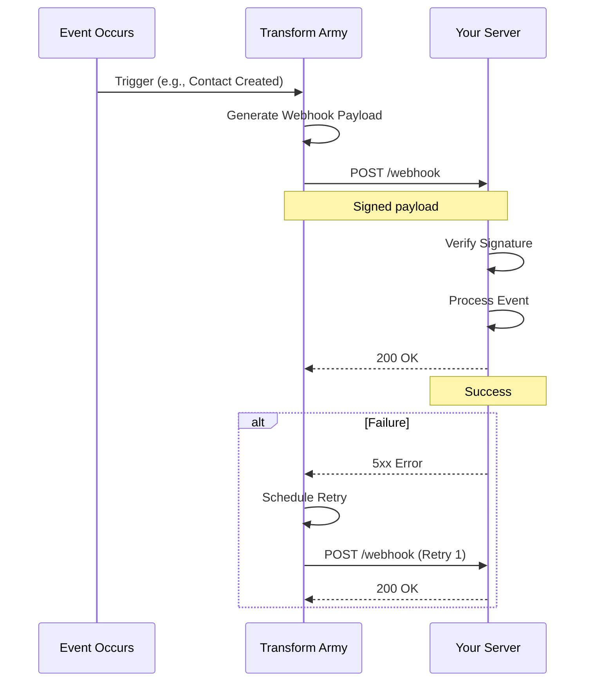

# Webhooks Documentation

> Real-time event notifications for Transform Army AI

## Table of Contents

- [Overview](#overview)
- [Getting Started](#getting-started)
- [Event Types](#event-types)
- [Payload Structure](#payload-structure)
- [Security](#security)
- [Retry Logic](#retry-logic)
- [Best Practices](#best-practices)
- [Testing Webhooks](#testing-webhooks)
- [Common Patterns](#common-patterns)
- [Troubleshooting](#troubleshooting)

---

## Overview

Webhooks allow your application to receive real-time notifications when events occur in Transform Army AI. Instead of polling our API, we'll push updates to your server immediately.

### How Webhooks Work



### Benefits

- ✅ **Real-time**: Immediate notifications
- ✅ **Efficient**: No polling required
- ✅ **Reliable**: Automatic retries
- ✅ **Secure**: Cryptographic signatures
- ✅ **Scalable**: Handle high event volumes

---

## Getting Started

### 1. Create Webhook Endpoint

Create an HTTP endpoint in your application to receive webhook events:

```python
# Flask example
from flask import Flask, request, jsonify
import hmac
import hashlib

app = Flask(__name__)
WEBHOOK_SECRET = "your_webhook_secret"

@app.route('/webhook', methods=['POST'])
def webhook():
    # Verify signature
    signature = request.headers.get('X-Webhook-Signature')
    if not verify_signature(request.data, signature, WEBHOOK_SECRET):
        return jsonify({"error": "Invalid signature"}), 401
    
    # Parse event
    event = request.json
    event_type = event['event_type']
    
    # Handle event
    if event_type == 'contact.created':
        handle_contact_created(event['data'])
    elif event_type == 'ticket.created':
        handle_ticket_created(event['data'])
    
    # Return 200 OK promptly
    return jsonify({"status": "received"}), 200

def verify_signature(payload, signature, secret):
    expected = hmac.new(
        secret.encode(),
        payload,
        hashlib.sha256
    ).hexdigest()
    
    provided = signature.split('=')[1] if '=' in signature else signature
    return hmac.compare_digest(expected, provided)
```

### 2. Register Webhook in Dashboard

1. Log in to Transform Army AI dashboard
2. Navigate to **Settings** → **Webhooks**
3. Click **Add Webhook**
4. Enter your endpoint URL
5. Select events to receive
6. Copy webhook secret for signature verification
7. Click **Save**

### 3. Test Webhook

Use the dashboard to send a test event:

1. Go to your webhook configuration
2. Click **Send Test Event**
3. Verify your endpoint receives the event
4. Check logs for any errors

---

## Event Types

### CRM Events

| Event Type | Description | Trigger |
|-----------|-------------|---------|
| `contact.created` | New contact created | Contact created via API or UI |
| `contact.updated` | Contact updated | Contact fields modified |
| `contact.deleted` | Contact deleted | Contact removed |
| `deal.created` | New deal created | Deal created |
| `deal.updated` | Deal updated | Deal stage or amount changed |
| `deal.won` | Deal closed as won | Deal marked as won |
| `deal.lost` | Deal closed as lost | Deal marked as lost |
| `note.created` | Note added to contact | Note created |

### Helpdesk Events

| Event Type | Description | Trigger |
|-----------|-------------|---------|
| `ticket.created` | New support ticket | Ticket created |
| `ticket.updated` | Ticket updated | Ticket fields modified |
| `ticket.status_changed` | Ticket status changed | Status updated (open, pending, solved, closed) |
| `ticket.priority_changed` | Priority changed | Priority modified |
| `ticket.assigned` | Ticket assigned | Ticket assigned to agent |
| `comment.created` | Comment added | Comment added to ticket |

### Calendar Events

| Event Type | Description | Trigger |
|-----------|-------------|---------|
| `event.created` | Calendar event created | Event scheduled |
| `event.updated` | Event updated | Event details modified |
| `event.deleted` | Event deleted | Event cancelled |
| `event.reminder` | Event reminder | 15 minutes before event |

### Email Events

| Event Type | Description | Trigger |
|-----------|-------------|---------|
| `email.sent` | Email sent successfully | Email delivered |
| `email.failed` | Email send failed | Delivery failed |
| `email.opened` | Email opened | Recipient opened email |
| `email.clicked` | Link clicked | Recipient clicked link |
| `email.bounced` | Email bounced | Hard or soft bounce |

### Workflow Events

| Event Type | Description | Trigger |
|-----------|-------------|---------|
| `workflow.started` | Workflow execution started | Workflow triggered |
| `workflow.step_completed` | Workflow step completed | Step finished |
| `workflow.completed` | Workflow execution completed | All steps finished |
| `workflow.failed` | Workflow execution failed | Error occurred |
| `workflow.timeout` | Workflow timed out | Exceeded time limit |

### System Events

| Event Type | Description | Trigger |
|-----------|-------------|---------|
| `api_key.created` | New API key created | API key generated |
| `api_key.revoked` | API key revoked | API key deactivated |
| `rate_limit.exceeded` | Rate limit exceeded | Too many requests |
| `webhook.failed` | Webhook delivery failed | All retries exhausted |

---

## Payload Structure

All webhook events follow a consistent structure:

```json
{
  "event_id": "evt_abc123xyz789",
  "event_type": "contact.created",
  "timestamp": "2025-10-31T05:00:00Z",
  "tenant_id": "tenant_xyz",
  "api_version": "v1",
  "data": {
    "id": "cont_abc123",
    "email": "john.doe@example.com",
    "first_name": "John",
    "last_name": "Doe",
    "company": "Acme Corp",
    "provider": "hubspot",
    "created_at": "2025-10-31T05:00:00Z"
  },
  "previous_data": null,
  "metadata": {
    "user_id": "user_xyz",
    "source": "api",
    "ip_address": "203.0.113.42"
  }
}
```

### Field Descriptions

| Field | Type | Description |
|-------|------|-------------|
| `event_id` | string | Unique event identifier |
| `event_type` | string | Type of event (see Event Types) |
| `timestamp` | string | ISO 8601 timestamp when event occurred |
| `tenant_id` | string | Tenant that triggered the event |
| `api_version` | string | API version (for compatibility) |
| `data` | object | Event data (varies by type) |
| `previous_data` | object | Previous state for update events |
| `metadata` | object | Additional context |

### Event-Specific Data

#### Contact Created

```json
{
  "event_type": "contact.created",
  "data": {
    "id": "cont_abc123",
    "email": "john.doe@example.com",
    "first_name": "John",
    "last_name": "Doe",
    "company": "Acme Corp",
    "phone": "+1-555-0123",
    "provider": "hubspot",
    "provider_id": "12345",
    "created_at": "2025-10-31T05:00:00Z",
    "url": "https://app.hubspot.com/contacts/12345"
  }
}
```

#### Contact Updated

```json
{
  "event_type": "contact.updated",
  "data": {
    "id": "cont_abc123",
    "email": "john.doe@example.com",
    "title": "VP of Sales",
    "phone": "+1-555-0199",
    "updated_at": "2025-10-31T06:00:00Z"
  },
  "previous_data": {
    "title": "Sales Manager",
    "phone": "+1-555-0123"
  }
}
```

#### Ticket Status Changed

```json
{
  "event_type": "ticket.status_changed",
  "data": {
    "id": "ticket_abc123",
    "subject": "Integration help needed",
    "status": "solved",
    "previous_status": "pending",
    "updated_at": "2025-10-31T07:00:00Z",
    "resolution_time_minutes": 145
  }
}
```

#### Workflow Completed

```json
{
  "event_type": "workflow.completed",
  "data": {
    "workflow_id": "workflow_abc123",
    "execution_id": "exec_xyz789",
    "name": "Lead Qualification Workflow",
    "status": "completed",
    "started_at": "2025-10-31T05:00:00Z",
    "completed_at": "2025-10-31T05:05:30Z",
    "duration_seconds": 330,
    "steps_completed": 3,
    "results": {
      "qualified": true,
      "score": 85
    }
  }
}
```

---

## Security

### Signature Verification

Every webhook request includes an `X-Webhook-Signature` header containing an HMAC-SHA256 signature:

```
X-Webhook-Signature: sha256=abc123def456...
```

**Always verify signatures** to ensure requests are from Transform Army AI.

### Python Verification

```python
import hmac
import hashlib

def verify_webhook_signature(payload: bytes, signature: str, secret: str) -> bool:
    """
    Verify webhook signature.
    
    Args:
        payload: Raw request body bytes
        signature: X-Webhook-Signature header value
        secret: Your webhook secret from dashboard
    
    Returns:
        True if signature is valid, False otherwise
    """
    # Extract hash from signature (format: sha256=hash)
    algorithm, provided_hash = signature.split('=', 1)
    
    if algorithm != 'sha256':
        return False
    
    # Compute expected signature
    expected_hash = hmac.new(
        secret.encode('utf-8'),
        payload,
        hashlib.sha256
    ).hexdigest()
    
    # Use constant-time comparison to prevent timing attacks
    return hmac.compare_digest(expected_hash, provided_hash)

# Flask example
@app.route('/webhook', methods=['POST'])
def webhook():
    signature = request.headers.get('X-Webhook-Signature')
    
    if not signature:
        return jsonify({"error": "Missing signature"}), 401
    
    if not verify_webhook_signature(request.data, signature, WEBHOOK_SECRET):
        return jsonify({"error": "Invalid signature"}), 401
    
    # Process event
    ...
```

### TypeScript Verification

```typescript
import crypto from 'crypto';

function verifyWebhookSignature(
  payload: string,
  signature: string,
  secret: string
): boolean {
  // Extract hash from signature
  const [algorithm, providedHash] = signature.split('=');
  
  if (algorithm !== 'sha256') {
    return false;
  }
  
  // Compute expected signature
  const expectedHash = crypto
    .createHmac('sha256', secret)
    .update(payload)
    .digest('hex');
  
  // Use constant-time comparison
  return crypto.timingSafeEqual(
    Buffer.from(expectedHash),
    Buffer.from(providedHash)
  );
}

// Express example
app.post('/webhook', express.raw({ type: 'application/json' }), (req, res) => {
  const signature = req.headers['x-webhook-signature'] as string;
  
  if (!signature) {
    return res.status(401).json({ error: 'Missing signature' });
  }
  
  if (!verifyWebhookSignature(req.body.toString(), signature, WEBHOOK_SECRET)) {
    return res.status(401).json({ error: 'Invalid signature' });
  }
  
  // Process event
  const event = JSON.parse(req.body.toString());
  ...
});
```

### Security Best Practices

1. **Always verify signatures**: Never skip signature verification
2. **Use HTTPS**: Only accept webhooks over HTTPS
3. **Validate event data**: Sanitize and validate all event data
4. **Store secrets securely**: Use environment variables or secret managers
5. **Log webhook events**: Keep audit trail of received events
6. **Implement rate limiting**: Protect against malicious traffic
7. **Use allowlists**: Restrict webhook IP addresses if possible

---

## Retry Logic

Transform Army AI automatically retries failed webhook deliveries.

### Retry Schedule

| Attempt | Delay | Total Time |
|---------|-------|------------|
| 1 (initial) | Immediate | 0s |
| 2 | 1 minute | 1m |
| 3 | 5 minutes | 6m |
| 4 | 15 minutes | 21m |
| 5 | 1 hour | 1h 21m |
| 6 | 6 hours | 7h 21m |

After 6 failed attempts (over ~7.5 hours), the webhook is marked as failed and you'll receive an alert.

### Success Criteria

A webhook delivery is considered successful if:
- HTTP status code is 2xx (200-299)
- Response received within 30 seconds
- No network errors

### Failure Scenarios

Retries occur for:
- **5xx errors** (500-599): Server errors
- **Network errors**: Timeouts, connection refused
- **4xx errors** (except 410): Client errors (temporary issues)

No retries for:
- **410 Gone**: Endpoint explicitly disabled
- **401 Unauthorized**: Invalid signature (permanent failure)

### Idempotency

**Important**: Your webhook endpoint must be idempotent. You may receive the same event multiple times due to retries.

```python
# Use event_id for deduplication
processed_events = set()

@app.route('/webhook', methods=['POST'])
def webhook():
    event = request.json
    event_id = event['event_id']
    
    # Check if already processed
    if event_id in processed_events:
        return jsonify({"status": "already_processed"}), 200
    
    # Process event
    process_event(event)
    
    # Mark as processed
    processed_events.add(event_id)
    
    return jsonify({"status": "processed"}), 200
```

---

## Best Practices

### 1. Return 200 OK Quickly

Process events asynchronously. Don't block the webhook request:

```python
from queue import Queue
from threading import Thread

event_queue = Queue()

def process_events_worker():
    """Background worker to process events."""
    while True:
        event = event_queue.get()
        try:
            process_event_sync(event)
        except Exception as e:
            logger.error(f"Failed to process event: {e}")
        finally:
            event_queue.task_done()

# Start worker thread
worker = Thread(target=process_events_worker, daemon=True)
worker.start()

@app.route('/webhook', methods=['POST'])
def webhook():
    # Verify signature
    if not verify_signature(...):
        return jsonify({"error": "Invalid signature"}), 401
    
    # Queue event for processing
    event = request.json
    event_queue.put(event)
    
    # Return immediately
    return jsonify({"status": "queued"}), 200
```

### 2. Implement Idempotency

Track processed events to handle duplicates:

```python
from redis import Redis

redis_client = Redis()

def is_event_processed(event_id: str) -> bool:
    """Check if event was already processed."""
    return redis_client.exists(f"webhook:processed:{event_id}")

def mark_event_processed(event_id: str, ttl: int = 86400):
    """Mark event as processed (TTL = 24 hours)."""
    redis_client.setex(
        f"webhook:processed:{event_id}",
        ttl,
        "1"
    )

@app.route('/webhook', methods=['POST'])
def webhook():
    event = request.json
    event_id = event['event_id']
    
    if is_event_processed(event_id):
        logger.info(f"Event {event_id} already processed")
        return jsonify({"status": "already_processed"}), 200
    
    # Process event
    process_event(event)
    mark_event_processed(event_id)
    
    return jsonify({"status": "processed"}), 200
```

### 3. Log Everything

Comprehensive logging helps debugging:

```python
import logging
import json

logger = logging.getLogger(__name__)

@app.route('/webhook', methods=['POST'])
def webhook():
    # Log incoming request
    logger.info(
        "Webhook received",
        extra={
            "headers": dict(request.headers),
            "remote_addr": request.remote_addr
        }
    )
    
    # Verify signature
    signature = request.headers.get('X-Webhook-Signature')
    if not verify_signature(request.data, signature, WEBHOOK_SECRET):
        logger.warning(
            "Invalid webhook signature",
            extra={"signature": signature}
        )
        return jsonify({"error": "Invalid signature"}), 401
    
    # Parse and log event
    event = request.json
    logger.info(
        f"Processing webhook event: {event['event_type']}",
        extra={
            "event_id": event['event_id'],
            "event_type": event['event_type'],
            "tenant_id": event['tenant_id']
        }
    )
    
    # Process event
    try:
        process_event(event)
        logger.info(f"Event {event['event_id']} processed successfully")
    except Exception as e:
        logger.error(
            f"Failed to process event {event['event_id']}",
            exc_info=e
        )
        return jsonify({"error": str(e)}), 500
    
    return jsonify({"status": "processed"}), 200
```

### 4. Handle Errors Gracefully

```python
@app.route('/webhook', methods=['POST'])
def webhook():
    try:
        # Verify signature
        if not verify_signature(...):
            return jsonify({"error": "Invalid signature"}), 401
        
        # Parse event
        event = request.json
        
        # Validate event structure
        if not event.get('event_id') or not event.get('event_type'):
            logger.error("Invalid event structure")
            return jsonify({"error": "Invalid event"}), 400
        
        # Process event
        process_event(event)
        
        return jsonify({"status": "processed"}), 200
        
    except json.JSONDecodeError:
        logger.error("Invalid JSON payload")
        return jsonify({"error": "Invalid JSON"}), 400
        
    except Exception as e:
        logger.error(f"Webhook processing error: {e}", exc_info=e)
        # Return 500 to trigger retry
        return jsonify({"error": "Internal server error"}), 500
```

### 5. Monitor Webhook Health

Track webhook performance and failures:

```python
from prometheus_client import Counter, Histogram

webhook_requests = Counter(
    'webhook_requests_total',
    'Total webhook requests',
    ['event_type', 'status']
)

webhook_duration = Histogram(
    'webhook_processing_duration_seconds',
    'Webhook processing duration',
    ['event_type']
)

@app.route('/webhook', methods=['POST'])
def webhook():
    event = request.json
    event_type = event.get('event_type', 'unknown')
    
    with webhook_duration.labels(event_type=event_type).time():
        try:
            process_event(event)
            webhook_requests.labels(event_type=event_type, status='success').inc()
            return jsonify({"status": "processed"}), 200
        except Exception as e:
            webhook_requests.labels(event_type=event_type, status='error').inc()
            raise
```

---

## Testing Webhooks

### Local Testing with ngrok

```bash
# Install ngrok
brew install ngrok  # macOS
# or download from https://ngrok.com

# Start your webhook server locally
python webhook_server.py  # runs on http://localhost:5000

# Create secure tunnel
ngrok http 5000

# ngrok will provide a public URL:
# https://abc123.ngrok.io -> http://localhost:5000

# Use this URL in Transform Army webhook configuration
```

### Test Event Generator

```python
import requests
import hmac
import hashlib
import json
from datetime import datetime

def send_test_webhook(
    url: str,
    event_type: str,
    data: dict,
    secret: str
):
    """Send a test webhook event."""
    
    # Create event payload
    event = {
        "event_id": f"test_{datetime.now().timestamp()}",
        "event_type": event_type,
        "timestamp": datetime.utcnow().isoformat() + "Z",
        "tenant_id": "test_tenant",
        "api_version": "v1",
        "data": data
    }
    
    payload = json.dumps(event)
    
    # Generate signature
    signature = hmac.new(
        secret.encode(),
        payload.encode(),
        hashlib.sha256
    ).hexdigest()
    
    # Send request
    response = requests.post(
        url,
        data=payload,
        headers={
            "Content-Type": "application/json",
            "X-Webhook-Signature": f"sha256={signature}"
        }
    )
    
    print(f"Status: {response.status_code}")
    print(f"Response: {response.text}")
    return response

# Usage
send_test_webhook(
    url="http://localhost:5000/webhook",
    event_type="contact.created",
    data={
        "id": "cont_test123",
        "email": "test@example.com",
        "first_name": "Test",
        "last_name": "User"
    },
    secret="your_webhook_secret"
)
```

### Automated Testing

```python
import unittest
from webhook_handler import verify_signature, process_event

class TestWebhookHandler(unittest.TestCase):
    def setUp(self):
        self.secret = "test_secret"
        self.valid_payload = b'{"event_type":"contact.created"}'
        
    def test_signature_verification_success(self):
        """Test valid signature verification."""
        signature = self._generate_signature(self.valid_payload)
        result = verify_signature(self.valid_payload, signature, self.secret)
        self.assertTrue(result)
    
    def test_signature_verification_failure(self):
        """Test invalid signature rejection."""
        invalid_signature = "sha256=invalid"
        result = verify_signature(self.valid_payload, invalid_signature, self.secret)
        self.assertFalse(result)
    
    def test_event_processing(self):
        """Test event processing logic."""
        event = {
            "event_id": "test_123",
            "event_type": "contact.created",
            "data": {"id": "cont_123", "email": "test@example.com"}
        }
        
        result = process_event(event)
        self.assertEqual(result["status"], "success")
    
    def _generate_signature(self, payload: bytes) -> str:
        """Generate valid signature for testing."""
        import hmac
        import hashlib
        hash_value = hmac.new(
            self.secret.encode(),
            payload,
            hashlib.sha256
        ).hexdigest()
        return f"sha256={hash_value}"

if __name__ == '__main__':
    unittest.main()
```

---

## Common Patterns

### Event Router

```python
from typing import Dict, Callable

class WebhookRouter:
    def __init__(self):
        self.handlers: Dict[str, Callable] = {}
    
    def route(self, event_type: str):
        """Decorator to register event handler."""
        def decorator(func: Callable):
            self.handlers[event_type] = func
            return func
        return decorator
    
    def handle_event(self, event: dict):
        """Route event to appropriate handler."""
        event_type = event['event_type']
        
        handler = self.handlers.get(event_type)
        if not handler:
            logger.warning(f"No handler for event type: {event_type}")
            return
        
        handler(event)

# Create router
router = WebhookRouter()

# Register handlers
@router.route('contact.created')
def handle_contact_created(event):
    contact = event['data']
    print(f"New contact: {contact['email']}")

@router.route('ticket.created')
def handle_ticket_created(event):
    ticket = event['data']
    print(f"New ticket: {ticket['subject']}")

# Use in webhook endpoint
@app.route('/webhook', methods=['POST'])
def webhook():
    if not verify_signature(...):
        return jsonify({"error": "Invalid signature"}), 401
    
    event = request.json
    router.handle_event(event)
    
    return jsonify({"status": "processed"}), 200
```

### Event Filtering

```python
def should_process_event(event: dict) -> bool:
    """Filter events based on criteria."""
    
    # Only process high-priority tickets
    if event['event_type'] == 'ticket.created':
        priority = event['data'].get('priority')
        return priority in ['high', 'urgent']
    
    # Only process qualified contacts
    if event['event_type'] == 'contact.created':
        metadata = event['data'].get('metadata', {})
        return metadata.get('qualified') == True
    
    # Process all other events
    return True

@app.route('/webhook', methods=['POST'])
def webhook():
    event = request.json
    
    if not should_process_event(event):
        logger.info(f"Event {event['event_id']} filtered out")
        return jsonify({"status": "filtered"}), 200
    
    process_event(event)
    return jsonify({"status": "processed"}), 200
```

---

## Troubleshooting

### Common Issues

#### 1. Signature Verification Fails

**Symptom**: All webhook requests return 401 Unauthorized

**Solutions**:
- Verify secret matches dashboard configuration
- Ensure using raw request body (not parsed JSON)
- Check for trailing newlines or whitespace
- Confirm using UTF-8 encoding

```python
# ❌ Wrong - using parsed JSON
signature = verify_signature(json.dumps(request.json), ...)

# ✅ Correct - using raw body
signature = verify_signature(request.data, ...)
```

#### 2. Events Not Received

**Symptom**: Webhook endpoint not receiving events

**Checklist**:
- [ ] Webhook URL is correct and publicly accessible
- [ ] Endpoint returns 2xx status code
- [ ] Endpoint responds within 30 seconds
- [ ] HTTPS is being used (if required)
- [ ] Firewall allows incoming connections
- [ ] Event types are selected in configuration

#### 3. Duplicate Events

**Symptom**: Receiving same event multiple times

**Explanation**: This is expected behavior due to retries

**Solution**: Implement idempotency

```python
# Track processed events
processed_events = set()

if event_id in processed_events:
    return jsonify({"status": "already_processed"}), 200
```

#### 4. Slow Processing

**Symptom**: Webhook requests timeout

**Solutions**:
- Return 200 OK immediately
- Process events asynchronously
- Use background workers/queues

```python
# Use queue for async processing
event_queue.put(event)
return jsonify({"status": "queued"}), 200
```

### Debugging Tips

1. **Check webhook logs** in Transform Army dashboard
2. **Enable debug logging** in your application
3. **Use webhook testing tools** (ngrok, RequestBin)
4. **Verify content-type** is `application/json`
5. **Test with curl**:

```bash
curl -X POST https://your-domain.com/webhook \
  -H "Content-Type: application/json" \
  -H "X-Webhook-Signature: sha256=abc..." \
  -d '{"event_id":"test","event_type":"contact.created",...}'
```

---

## Support

Need help with webhooks?

- 📖 **Documentation**: https://docs.transform-army.ai/webhooks
- 💬 **Chat Support**: Available in dashboard
- 📧 **Email**: support@transform-army.ai
- 🐛 **Report Issues**: https://github.com/transform-army-ai/platform/issues

---

*Last Updated: 2025-10-31* | *Webhook Version: 1.0*