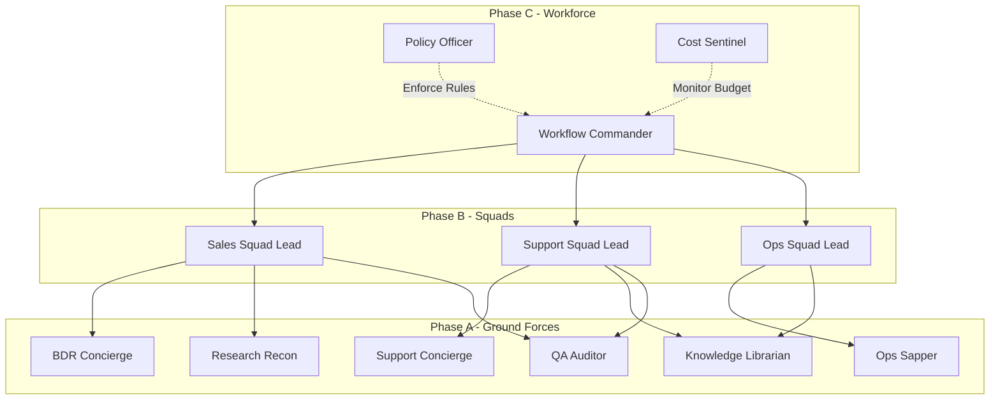
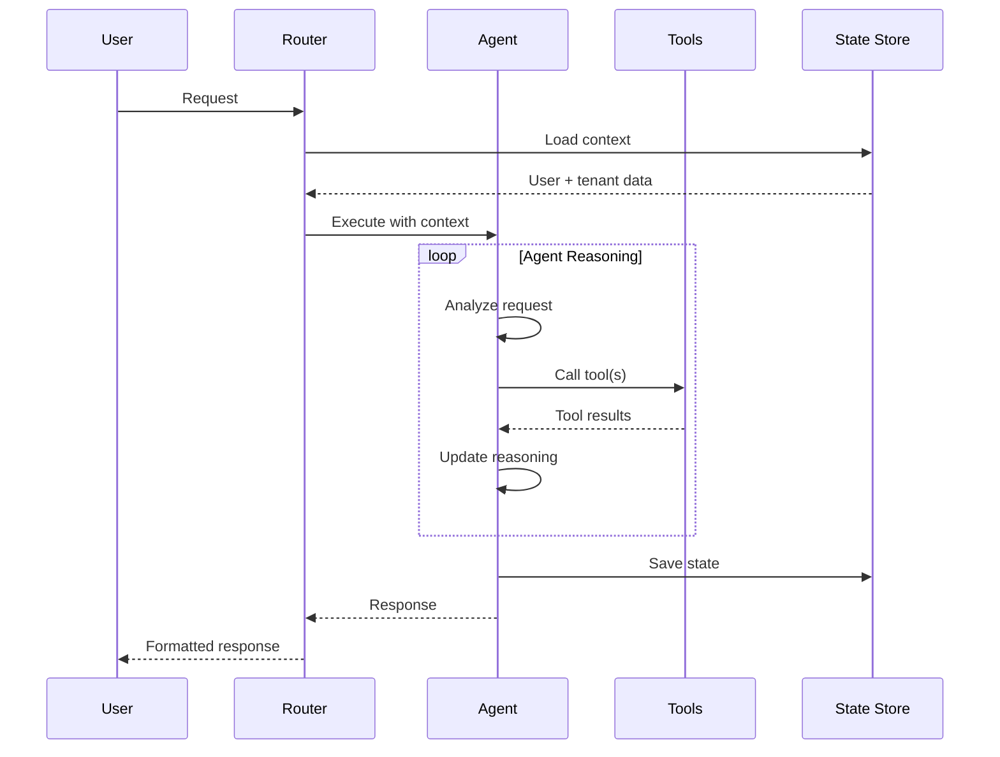
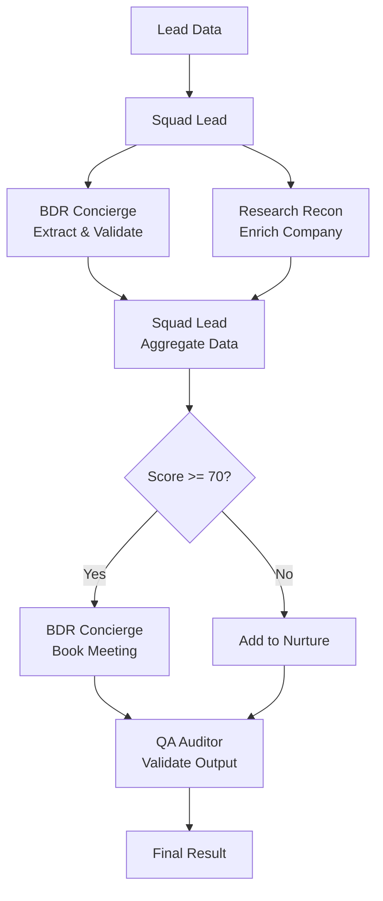
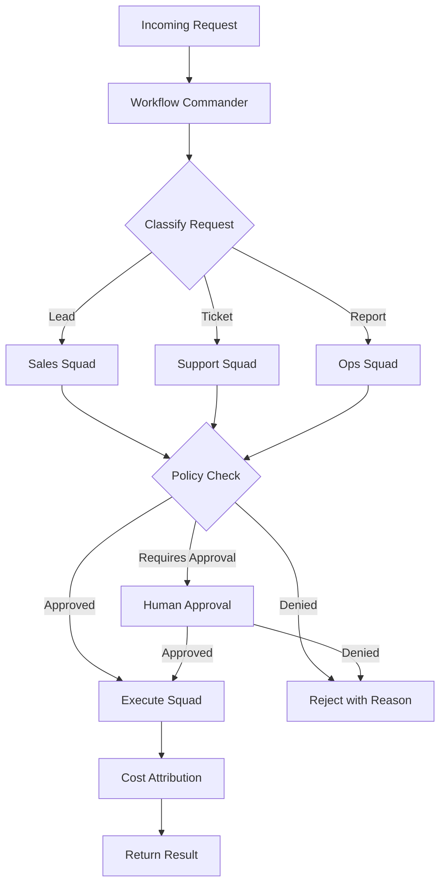

# Agent Orchestration Patterns

**Version:** 1.0.0  
**Last Updated:** 2025-10-31  
**System:** Transform Army AI Multi-Agent Coordination

---

## Table of Contents

1. [Overview](#overview)
2. [Evolution Strategy](#evolution-strategy)
3. [Agent Architecture](#agent-architecture)
4. [Single Agent Pattern](#single-agent-pattern)
5. [Squad Pattern](#squad-pattern)
6. [Workforce Pattern](#workforce-pattern)
7. [State Management](#state-management)
8. [Variable Passing](#variable-passing)
9. [Coordination Mechanisms](#coordination-mechanisms)
10. [Error Handling](#error-handling)
11. [Implementation Examples](#implementation-examples)

---

## Overview

Transform Army AI uses a hierarchical multi-agent system that evolves from simple single-agent tasks to complex workforce orchestration. This document defines the patterns, coordination mechanisms, and state management approaches.

### Agent Force Structure



### Key Principles

1. **Hierarchical Delegation**: Higher-level agents coordinate lower-level agents
2. **Deterministic Flow**: Variable passing ensures predictable execution
3. **State Isolation**: Each agent operates on its own state slice
4. **Idempotent Actions**: All agent actions can be safely retried
5. **Observable Execution**: Complete audit trail of all decisions

---

## Evolution Strategy

### Phase A: Ground Forces (Week 1-4)

**Objective**: Deploy individual agents for specific tasks

**Characteristics**:
- Single-agent execution
- Direct invocation via Relevance AI
- Minimal coordination required
- Quick wins, demonstrable value

**Agents Deployed**:
1. **BDR Concierge** - Lead qualification, meeting booking
2. **Support Concierge** - Ticket deflection, escalation
3. **Research Recon** - Competitive intelligence, market research
4. **Ops Sapper** - SLA monitoring, hygiene checks
5. **Knowledge Librarian** - Document ingestion, retrieval
6. **QA Auditor** - Output quality scoring

**Example Task**: Qualify a single inbound lead

```
User Request → BDR Concierge → CRM Check → Qualification → Meeting Booked
```

### Phase B: Squad Formation (Week 5-12)

**Objective**: Coordinate multiple agents for complex workflows

**Characteristics**:
- Multi-agent collaboration
- Sequential and parallel execution
- Deterministic variable passing between agents
- Shared context within squad

**Squads Formed**:

**Sales Squad** (Lead-to-Opportunity)
- BDR Concierge: Lead qualification
- Research Recon: Company enrichment
- QA Auditor: Validation

**Support Squad** (Ticket-to-Resolution)
- Support Concierge: Triage and routing
- Knowledge Librarian: Solution lookup
- QA Auditor: Response quality check

**Ops Squad** (Monitoring-to-Action)
- Ops Sapper: SLA detection
- Librarian: Historical context
- BDR: Escalation if needed

**Example Task**: End-to-end lead qualification

```
User Request → Sales Squad Lead
  ├─> BDR Concierge: Extract lead data
  ├─> Research Recon: Enrich company profile
  ├─> BDR Concierge: Score and route
  └─> QA Auditor: Validate output
Result → Qualified lead in CRM
```

### Phase C: Workforce Command (Week 13+)

**Objective**: Enterprise-scale orchestration with approval gates

**Characteristics**:
- Workflow Commander routes work across squads
- Policy Officer enforces compliance rules
- Cost Sentinel manages budget allocation
- Human-in-the-loop for critical decisions
- Advanced state machines with LangGraph

**Example Task**: Complex customer escalation

```
Ticket Created → Workflow Commander
  ├─> Policy Check: Is escalation needed?
  ├─> Support Squad: Initial triage
  ├─> (If high-value) Sales Squad: Account context
  ├─> Human Approval: Discount authorization
  └─> Cost Attribution: Track spend
Result → Resolved with audit trail
```

---

## Agent Architecture

### Agent Anatomy

Every agent has:

```python
class Agent:
    """Base agent structure"""
    
    # Identity
    agent_id: str              # Unique identifier
    agent_type: str            # Role type (bdr, support, etc.)
    version: str               # Agent version
    
    # Capabilities
    tools: List[Tool]          # Available tools
    knowledge: List[str]       # Knowledge base IDs
    instructions: str          # System prompt
    
    # Configuration
    model: str                 # LLM model
    temperature: float         # Creativity level
    max_tokens: int            # Response length limit
    
    # Policies
    approval_required: bool    # Human approval needed
    budget_limit: float        # Cost threshold
    timeout_seconds: int       # Execution timeout
```

### Base Agent Definitions

#### 1. BDR Concierge

**Role**: Lead qualification, meeting coordination, CRM enrichment

**Capabilities**:
- Extract lead information from conversations/forms
- Search CRM for duplicates
- Score leads against qualification criteria
- Book meetings with qualified leads
- Update CRM with enrichment data

**Tools**:
- `crm.contacts.search`
- `crm.contacts.create`
- `crm.notes.add`
- `calendar.events.create`
- `calendar.availability.find`
- `email.send`

**System Prompt**:
```
You are the BDR Concierge, responsible for qualifying inbound leads and coordinating initial meetings.

Your qualification criteria:
1. Company size: 50+ employees
2. Budget authority: Director level or above
3. Use case alignment: Must match our ICP
4. Timeline: Active project within 90 days

Process:
1. Extract lead details from conversation
2. Search CRM for duplicates by email/company
3. If new lead, score against criteria (0-100)
4. If score >= 70, book discovery meeting
5. Update CRM with all findings

Always maintain a professional, helpful tone.
```

#### 2. Support Concierge

**Role**: Ticket triage, deflection, escalation with context

**Capabilities**:
- Classify ticket priority and category
- Search knowledge base for solutions
- Attempt self-service deflection
- Escalate with full context if needed
- Track resolution metrics

**Tools**:
- `helpdesk.tickets.read`
- `helpdesk.tickets.update`
- `helpdesk.comments.add`
- `knowledge.search`
- `crm.contacts.search`

**System Prompt**:
```
You are the Support Concierge, first responder for all support tickets.

Triage criteria:
- P1 (Critical): Production down, data loss, security breach
- P2 (High): Major feature broken, multiple users affected
- P3 (Medium): Single user impact, workaround available
- P4 (Low): Feature requests, questions

Process:
1. Read ticket details and user history
2. Search knowledge base for solutions
3. If found, respond with solution and mark resolved
4. If not found or complex, escalate to human with:
   - Full context summary
   - User account details
   - Similar past tickets
   - Suggested next steps

Be empathetic and clear in all communications.
```

#### 3. Research Recon

**Role**: Competitive intelligence, company enrichment, market research

**Capabilities**:
- Web research and data extraction
- Competitive analysis
- Company profile enrichment
- Industry trend monitoring
- Report generation

**Tools**:
- `web.search`
- `web.scrape`
- `crm.companies.search`
- `crm.companies.update`
- `knowledge.search`

**System Prompt**:
```
You are Research Recon, intelligence gatherer for sales and strategy.

Research areas:
1. Company profiles (size, revenue, tech stack, key people)
2. Competitor analysis (features, pricing, positioning)
3. Market trends (industry news, regulations, shifts)

Output format:
- Executive Summary (3-5 bullets)
- Key Findings (detailed insights)
- Recommendations (actionable next steps)
- Sources (all URLs with access dates)

Be thorough, objective, and cite all sources.
```

#### 4. Ops Sapper

**Role**: Operational monitoring, SLA tracking, hygiene maintenance

**Capabilities**:
- Monitor SLA compliance
- Detect anomalies in metrics
- Generate operational reports
- Trigger alerts for issues
- Cleanup and maintenance tasks

**Tools**:
- `helpdesk.tickets.search`
- `crm.deals.search`
- `analytics.query`
- `slack.notify`
- `email.send`

**System Prompt**:
```
You are Ops Sapper, ensuring operational excellence.

Monitoring duties:
1. SLA compliance (response time, resolution time)
2. Data quality (missing fields, duplicates)
3. Process adherence (required steps completed)
4. Cost efficiency (resource utilization)

Alert thresholds:
- SLA breach: Immediate Slack notification
- Data quality < 95%: Daily digest
- Cost overrun > 20%: Email to manager

Weekly reports include:
- SLA performance vs targets
- Quality metrics with trends
- Cost attribution by team/project
- Recommendations for improvement
```

#### 5. Knowledge Librarian

**Role**: Document management, knowledge curation, retrieval optimization

**Capabilities**:
- Ingest and vectorize documents
- Curate knowledge base
- Optimize retrieval accuracy
- Detect knowledge gaps
- Maintain document freshness

**Tools**:
- `knowledge.articles.create`
- `knowledge.articles.update`
- `knowledge.search`
- `web.scrape`
- `crm.notes.search`

**System Prompt**:
```
You are the Knowledge Librarian, curator of organizational knowledge.

Responsibilities:
1. Ingest new documents with proper categorization
2. Maintain knowledge quality (accuracy, freshness, completeness)
3. Optimize retrieval (improve search results)
4. Detect gaps (questions without good answers)
5. Recommend content updates

Quality standards:
- All articles must have category, tags, last_updated
- Content must be verified and cited
- Search results must score > 0.7 relevance
- Stale content (> 90 days) flagged for review

Be meticulous and organized.
```

#### 6. QA Auditor

**Role**: Output validation, quality scoring, pattern detection

**Capabilities**:
- Score outputs against rubrics
- Detect quality issues
- Track performance trends
- Flag anomalies
- Generate improvement recommendations

**Tools**:
- `analytics.query`
- `crm.notes.search`
- `helpdesk.tickets.search`
- `slack.notify`

**System Prompt**:
```
You are QA Auditor, guardian of quality standards.

Evaluation rubrics:
1. Accuracy (facts correct, citations valid): 0-10
2. Completeness (all required elements present): 0-10
3. Tone (appropriate, professional): 0-10
4. Format (structure, readability): 0-10
5. Compliance (policies followed): 0-10

Total score: Sum / 5 (0-10 scale)

Quality thresholds:
- Score >= 8.0: Excellent
- Score 6.0-7.9: Acceptable
- Score < 6.0: Needs improvement

When score < 6.0:
- Flag for review
- Identify specific issues
- Recommend training or process changes

Be objective and constructive.
```

---

## Single Agent Pattern

### Execution Flow



### State Structure

```json
{
  "agent_execution_id": "exec_abc123",
  "agent_id": "agent_bdr_001",
  "tenant_id": "tenant_001",
  "user_id": "user_456",
  "started_at": "2025-10-31T01:17:00Z",
  "status": "completed",
  "context": {
    "request": "Qualify this lead: john.doe@example.com",
    "conversation_history": [],
    "user_data": {}
  },
  "steps": [
    {
      "step_id": "step_001",
      "action": "crm.contacts.search",
      "parameters": {"query": "john.doe@example.com"},
      "result": {"matches": []},
      "timestamp": "2025-10-31T01:17:01Z"
    },
    {
      "step_id": "step_002",
      "action": "web.search",
      "parameters": {"query": "Acme Corp company info"},
      "result": {"company_size": 500},
      "timestamp": "2025-10-31T01:17:03Z"
    }
  ],
  "result": {
    "qualified": true,
    "score": 85,
    "reasoning": "Company meets size requirement..."
  },
  "completed_at": "2025-10-31T01:17:05Z",
  "duration_ms": 5000,
  "cost": 0.02
}
```

---

## Squad Pattern

### Squad Composition

A squad is a coordinated group of agents working toward a shared goal.

**Squad Lead Responsibilities**:
- Decompose complex tasks into agent-specific subtasks
- Orchestrate sequential and parallel execution
- Manage variable passing between agents
- Aggregate results
- Handle errors and retries

### Sales Squad Example



### Variable Passing

Variables flow between agents using deterministic schemas:

```python
from typing import TypedDict, Optional
from datetime import datetime

class LeadQualificationInput(TypedDict):
    """Input to Sales Squad"""
    email: str
    name: Optional[str]
    company: Optional[str]
    source: str
    raw_message: str

class BDROutput(TypedDict):
    """Output from BDR initial processing"""
    lead_data: dict
    crm_duplicate: Optional[str]
    initial_score: int
    validation_passed: bool

class ResearchOutput(TypedDict):
    """Output from Research Recon"""
    company_profile: dict
    competitor_info: dict
    tech_stack: list[str]
    decision_makers: list[dict]
    enrichment_confidence: float

class SalesSquadState(TypedDict):
    """Complete squad state"""
    input: LeadQualificationInput
    bdr_result: Optional[BDROutput]
    research_result: Optional[ResearchOutput]
    final_score: Optional[int]
    qualification_decision: Optional[str]
    meeting_booked: Optional[dict]
    qa_score: Optional[float]
```

### Execution Patterns

#### Sequential Execution

Tasks must complete in order:

```python
async def sales_squad_sequential(state: SalesSquadState):
    """Execute sales squad sequentially"""
    
    # Step 1: BDR extracts and validates
    bdr_result = await execute_agent(
        agent_id="bdr_concierge",
        input=state["input"]
    )
    state["bdr_result"] = bdr_result
    
    # Step 2: Research enriches (depends on BDR)
    research_result = await execute_agent(
        agent_id="research_recon",
        input={
            "company": bdr_result["lead_data"]["company"],
            "domain": extract_domain(bdr_result["lead_data"]["email"])
        }
    )
    state["research_result"] = research_result
    
    # Step 3: BDR scores (depends on both)
    final_score = await execute_agent(
        agent_id="bdr_concierge",
        action="score_lead",
        input={
            "lead_data": bdr_result["lead_data"],
            "enrichment": research_result["company_profile"]
        }
    )
    state["final_score"] = final_score
    
    return state
```

#### Parallel Execution

Independent tasks run concurrently:

```python
async def sales_squad_parallel(state: SalesSquadState):
    """Execute independent tasks in parallel"""
    
    # Step 1: BDR extraction (must go first)
    bdr_result = await execute_agent(
        agent_id="bdr_concierge",
        input=state["input"]
    )
    state["bdr_result"] = bdr_result
    
    # Step 2: Parallel enrichment tasks
    research_task = execute_agent(
        agent_id="research_recon",
        input={"company": bdr_result["lead_data"]["company"]}
    )
    
    crm_history_task = execute_agent(
        agent_id="ops_sapper",
        action="get_account_history",
        input={"company": bdr_result["lead_data"]["company"]}
    )
    
    # Wait for both
    research_result, history_result = await asyncio.gather(
        research_task,
        crm_history_task
    )
    
    state["research_result"] = research_result
    state["history_result"] = history_result
    
    return state
```

---

## Workforce Pattern

### Workflow Commander

The Workflow Commander is a meta-agent that routes work across squads and manages complex workflows.



### Policy Officer

Enforces business rules and compliance requirements:

```python
class PolicyOfficer:
    """Enforces business policies"""
    
    async def check_policy(
        self,
        workflow: str,
        parameters: dict,
        context: dict
    ) -> PolicyDecision:
        """Check if workflow execution is permitted"""
        
        # Check budget
        if context["monthly_spend"] > context["budget_limit"]:
            return PolicyDecision(
                approved=False,
                reason="Monthly budget exceeded",
                action_required="Requires CFO approval"
            )
        
        # Check compliance
        if "pii_data" in parameters and not context["gdpr_certified"]:
            return PolicyDecision(
                approved=False,
                reason="Cannot process PII without GDPR certification",
                action_required="Complete GDPR training"
            )
        
        # Check authorization
        if workflow == "discount_approval" and parameters["amount"] > 10000:
            return PolicyDecision(
                approved=False,
                reason="Discount exceeds approval limit",
                action_required="Requires VP approval",
                requires_human_approval=True
            )
        
        return PolicyDecision(approved=True)
```

### Cost Sentinel

Tracks and optimizes spend:

```python
class CostSentinel:
    """Monitors and optimizes costs"""
    
    async def track_action_cost(
        self,
        action_id: str,
        agent_id: str,
        tenant_id: str,
        tokens_used: int,
        model: str
    ) -> CostAttribution:
        """Track cost of agent action"""
        
        # Calculate cost based on model pricing
        cost = self._calculate_cost(tokens_used, model)
        
        # Store attribution
        await self._store_cost(
            action_id=action_id,
            agent_id=agent_id,
            tenant_id=tenant_id,
            cost=cost,
            tokens=tokens_used,
            model=model
        )
        
        # Check if approaching budget limit
        monthly_total = await self._get_monthly_total(tenant_id)
        budget_limit = await self._get_budget_limit(tenant_id)
        
        if monthly_total > budget_limit * 0.9:
            await self._alert_budget_threshold(
                tenant_id=tenant_id,
                current=monthly_total,
                limit=budget_limit,
                percentage=90
            )
        
        return CostAttribution(
            action_id=action_id,
            cost=cost,
            monthly_total=monthly_total,
            remaining_budget=budget_limit - monthly_total
        )
```

---

## State Management

### LangGraph State Machines

LangGraph provides deterministic state management for multi-agent workflows.

```python
from langgraph.graph import StateGraph, END
from typing import TypedDict, Annotated
import operator

class SalesSquadState(TypedDict):
    """State for sales squad workflow"""
    # Inputs
    lead_email: str
    lead_name: str
    lead_company: str
    
    # Intermediate results (accumulated)
    messages: Annotated[list, operator.add]
    tool_results: dict
    
    # Outputs
    qualification_score: int
    decision: str
    crm_id: str

# Define workflow graph
workflow = StateGraph(SalesSquadState)

# Add nodes (agents)
workflow.add_node("extract_lead", extract_lead_agent)
workflow.add_node("enrich_company", enrich_company_agent)
workflow.add_node("score_lead", score_lead_agent)
workflow.add_node("book_meeting", book_meeting_agent)

# Define edges (flow)
workflow.set_entry_point("extract_lead")
workflow.add_edge("extract_lead", "enrich_company")
workflow.add_edge("enrich_company", "score_lead")

# Conditional routing
workflow.add_conditional_edges(
    "score_lead",
    should_book_meeting,
    {
        "book": "book_meeting",
        "nurture": END
    }
)
workflow.add_edge("book_meeting", END)

# Compile
app = workflow.compile()
```

### State Persistence

State is persisted at checkpoints:

```python
class StateStore:
    """Persistent state storage"""
    
    async def save_checkpoint(
        self,
        workflow_id: str,
        state: dict,
        step: str
    ):
        """Save state at checkpoint"""
        await self.db.execute(
            """
            INSERT INTO workflow_checkpoints 
            (workflow_id, step, state, created_at)
            VALUES ($1, $2, $3, NOW())
            """,
            workflow_id, step, json.dumps(state)
        )
    
    async def load_checkpoint(
        self,
        workflow_id: str,
        step: Optional[str] = None
    ) -> dict:
        """Load state from checkpoint"""
        if step:
            # Load specific checkpoint
            row = await self.db.fetchrow(
                """
                SELECT state FROM workflow_checkpoints
                WHERE workflow_id = $1 AND step = $2
                ORDER BY created_at DESC LIMIT 1
                """,
                workflow_id, step
            )
        else:
            # Load latest checkpoint
            row = await self.db.fetchrow(
                """
                SELECT state FROM workflow_checkpoints
                WHERE workflow_id = $1
                ORDER BY created_at DESC LIMIT 1
                """,
                workflow_id
            )
        
        return json.loads(row["state"]) if row else {}
```

### Recovery and Replay

Workflows can be resumed from checkpoints:

```python
async def resume_workflow(workflow_id: str):
    """Resume workflow from last checkpoint"""
    
    # Load latest state
    state = await state_store.load_checkpoint(workflow_id)
    
    # Determine next step
    completed_steps = state.get("completed_steps", [])
    next_step = determine_next_step(completed_steps)
    
    # Resume execution
    result = await app.invoke(
        state,
        config={
            "configurable": {
                "thread_id": workflow_id,
                "checkpoint_id": state["checkpoint_id"]
            }
        }
    )
    
    return result
```

---

## Coordination Mechanisms

### Event-Driven Coordination

Agents communicate via events:

```python
class AgentEvent:
    """Event emitted by agent"""
    event_id: str
    agent_id: str
    event_type: str  # "task_completed", "error", "approval_needed"
    payload: dict
    timestamp: datetime

# Event bus
class EventBus:
    async def publish(self, event: AgentEvent):
        """Publish event to subscribers"""
        subscribers = await self._get_subscribers(event.event_type)
        for subscriber in subscribers:
            await subscriber.handle_event(event)
    
    async def subscribe(self, event_type: str, handler):
        """Subscribe to event type"""
        await self._register_subscriber(event_type, handler)

# Usage
bus = EventBus()

# Agent subscribes to events
await bus.subscribe("lead_qualified", sales_squad.handle_qualified_lead)

# Agent publishes event
await bus.publish(AgentEvent(
    agent_id="bdr_concierge",
    event_type="lead_qualified",
    payload={"lead_id": "lead_123", "score": 85}
))
```

### Shared Memory

Agents share context via shared memory:

```python
class SharedMemory:
    """Shared context between agents"""
    
    def __init__(self, redis_client):
        self.redis = redis_client
    
    async def set(self, key: str, value: dict, ttl: int = 3600):
        """Store value with TTL"""
        await self.redis.setex(
            key,
            ttl,
            json.dumps(value)
        )
    
    async def get(self, key: str) -> Optional[dict]:
        """Retrieve value"""
        value = await self.redis.get(key)
        return json.loads(value) if value else None
    
    async def append(self, key: str, item: dict):
        """Append to list"""
        await self.redis.rpush(key, json.dumps(item))
    
    async def get_list(self, key: str) -> list[dict]:
        """Get entire list"""
        items = await self.redis.lrange(key, 0, -1)
        return [json.loads(item) for item in items]

# Usage
memory = SharedMemory(redis_client)

# Agent A stores data
await memory.set(
    f"workflow:{workflow_id}:lead_data",
    {"email": "john@example.com", "company": "Acme"}
)

# Agent B retrieves data
lead_data = await memory.get(f"workflow:{workflow_id}:lead_data")
```

### Human-in-the-Loop

Workflows can pause for human approval:

```python
class ApprovalGate:
    """Human approval mechanism"""
    
    async def request_approval(
        self,
        workflow_id: str,
        request: dict
    ) -> str:
        """Request human approval"""
        
        approval_id = generate_id()
        
        # Store approval request
        await self.db.execute(
            """
            INSERT INTO approval_requests
            (approval_id, workflow_id, request_data, status, created_at)
            VALUES ($1, $2, $3, 'pending', NOW())
            """,
            approval_id, workflow_id, json.dumps(request)
        )
        
        # Notify approvers
        await self._notify_approvers(approval_id, request)
        
        return approval_id
    
    async def wait_for_approval(
        self,
        approval_id: str,
        timeout: int = 3600
    ) -> bool:
        """Wait for approval decision"""
        
        start_time = time.time()
        
        while time.time() - start_time < timeout:
            status = await self._check_approval_status(approval_id)
            
            if status == "approved":
                return True
            elif status == "denied":
                return False
            
            await asyncio.sleep(5)  # Poll every 5 seconds
        
        raise TimeoutError("Approval timeout exceeded")
```

---

## Error Handling

### Agent-Level Errors

```python
class AgentError(Exception):
    """Base exception for agent errors"""
    pass

class ToolExecutionError(AgentError):
    """Tool failed to execute"""
    def __init__(self, tool: str, error: str):
        self.tool = tool
        self.error = error
        super().__init__(f"Tool {tool} failed: {error}")

class ValidationError(AgentError):
    """Input validation failed"""
    pass

class PolicyViolation(AgentError):
    """Policy check failed"""
    pass

# Error handling in agent
async def execute_agent_with_retry(
    agent_id: str,
    input: dict,
    max_retries: int = 3
):
    """Execute agent with automatic retry"""
    
    for attempt in range(max_retries):
        try:
            result = await execute_agent(agent_id, input)
            return result
        
        except ToolExecutionError as e:
            if e.tool in RETRIABLE_TOOLS and attempt < max_retries - 1:
                await asyncio.sleep(2 ** attempt)  # Exponential backoff
                continue
            else:
                raise
        
        except ValidationError:
            # Don't retry validation errors
            raise
        
        except Exception as e:
            logger.error(f"Agent {agent_id} failed: {e}")
            if attempt < max_retries - 1:
                await asyncio.sleep(2 ** attempt)
                continue
            else:
                raise
```

### Workflow-Level Recovery

```python
class WorkflowRecovery:
    """Handles workflow failures"""
    
    async def handle_failure(
        self,
        workflow_id: str,
        error: Exception,
        state: dict
    ):
        """Handle workflow failure"""
        
        # Save failure state
        await self._save_failure_state(workflow_id, state, error)
        
        # Determine recovery action
        if isinstance(error, ToolExecutionError):
            # Retry with different provider
            return RecoveryAction.RETRY_WITH_ALTERNATE_PROVIDER
        
        elif isinstance(error, PolicyViolation):
            # Request approval
            return RecoveryAction.REQUEST_APPROVAL
        
        elif isinstance(error, ValidationError):
            # Return to user for clarification
            return RecoveryAction.REQUEST_USER_INPUT
        
        else:
            # Unknown error, fail workflow
            return RecoveryAction.FAIL_WORKFLOW
    
    async def retry_workflow(
        self,
        workflow_id: str,
        recovery_action: RecoveryAction
    ):
        """Retry workflow with recovery action"""
        
        # Load failure state
        state = await self._load_failure_state(workflow_id)
        
        # Apply recovery action
        if recovery_action == RecoveryAction.RETRY_WITH_ALTERNATE_PROVIDER:
            state["force_provider"] = "alternate"
        
        # Resume workflow
        return await resume_workflow(workflow_id)
```

---

## Implementation Examples

### Example 1: Simple Lead Qualification

```python
from langgraph.graph import StateGraph, END

class LeadQualState(TypedDict):
    email: str
    name: str
    company: str
    qualified: bool
    score: int

async def extract_lead(state: LeadQualState) -> LeadQualState:
    """Extract and validate lead data"""
    # Validate email format
    if not is_valid_email(state["email"]):
        raise ValidationError("Invalid email format")
    
    # Check for duplicates
    duplicate = await crm.search_contacts(email=state["email"])
    if duplicate:
        state["qualified"] = False
        state["score"] = 0
        return state
    
    return state

async def score_lead(state: LeadQualState) -> LeadQualState:
    """Score lead against criteria"""
    score = 0
    
    # Check company size
    company_data = await research.get_company_info(state["company"])
    if company_data["employee_count"] >= 50:
        score += 40
    
    # Check decision maker level
    if "VP" in state["name"] or "Director" in state["name"]:
        score += 30
    
    # Check engagement
    engagement = await crm.get_engagement_score(state["email"])
    score += min(30, engagement)
    
    state["score"] = score
    state["qualified"] = score >= 70
    
    return state

def should_qualify(state: LeadQualState) -> str:
    """Route based on qualification"""
    return "qualified" if state["qualified"] else "unqualified"

# Build workflow
workflow = StateGraph(LeadQualState)
workflow.add_node("extract", extract_lead)
workflow.add_node("score", score_lead)

workflow.set_entry_point("extract")
workflow.add_edge("extract", "score")
workflow.add_conditional_edges(
    "score",
    should_qualify,
    {
        "qualified": END,
        "unqualified": END
    }
)

app = workflow.compile()

# Execute
result = await app.ainvoke({
    "email": "john@acme.com",
    "name": "John Doe, VP Sales",
    "company": "Acme Corp"
})
```

### Example 2: Support Ticket Triage Squad

```python
class TicketTriageState(TypedDict):
    ticket_id: str
    subject: str
    description: str
    priority: str
    category: str
    solution: Optional[str]
    escalated: bool

async def classify_ticket(state: TicketTriageState) -> TicketTriageState:
    """Classify ticket priority and category"""
    
    # Use Support Concierge to classify
    classification = await execute_agent(
        agent_id="support_concierge",
        action="classify",
        input={
            "subject": state["subject"],
            "description": state["description"]
        }
    )
    
    state["priority"] = classification["priority"]
    state["category"] = classification["category"]
    
    return state

async def search_knowledge(state: TicketTriageState) -> TicketTriageState:
    """Search for solution in knowledge base"""
    
    # Use Knowledge Librarian
    results = await execute_agent(
        agent_id="knowledge_librarian",
        action="search",
        input={
            "query": f"{state['subject']} {state['description']}",
            "category": state["category"]
        }
    )
    
    if results["matches"] and results["matches"][0]["score"] > 0.8:
        state["solution"] = results["matches"][0]["content"]
    
    return state

async def respond_or_escalate(state: TicketTriageState) -> TicketTriageState:
    """Respond with solution or escalate"""
    
    if state["solution"]:
        # Post solution
        await helpdesk.add_comment(
            ticket_id=state["ticket_id"],
            comment=state["solution"]
        )
        await helpdesk.update_status(
            ticket_id=state["ticket_id"],
            status="solved"
        )
        state["escalated"] = False
    else:
        # Escalate to human
        await helpdesk.add_comment(
            ticket_id=state["ticket_id"],
            comment="Escalating to human support agent for specialized assistance."
        )
        await helpdesk.assign_to_human(state["ticket_id"])
        state["escalated"] = True
    
    return state

# Build workflow
workflow = StateGraph(TicketTriageState)
workflow.add_node("classify", classify_ticket)
workflow.add_node("search", search_knowledge)
workflow.add_node("respond", respond_or_escalate)

workflow.set_entry_point("classify")
workflow.add_edge("classify", "search")
workflow.add_edge("search", "respond")
workflow.add_edge("respond", END)

app = workflow.compile()
```

---

## Best Practices

### 1. Design for Observability

- Log all agent decisions with reasoning
- Track all tool invocations
- Measure performance at each step
- Capture user feedback

### 2. Make Workflows Deterministic

- Use typed state definitions
- Validate inputs and outputs
- Handle all edge cases explicitly
- Avoid non-deterministic operations

### 3. Implement Gradual Rollout

- Start with single agents
- Add coordination gradually
- A/B test new patterns
- Monitor quality metrics

### 4. Optimize for Cost

- Cache expensive operations
- Batch API calls where possible
- Use smaller models for simple tasks
- Monitor token usage

### 5. Plan for Failures

- Implement retry logic
- Provide fallback options
- Save checkpoints frequently
- Enable manual recovery

---

## Monitoring and Metrics

### Agent Performance Metrics

| Metric | Description | Target |
|--------|-------------|--------|
| **Success Rate** | % of tasks completed successfully | > 95% |
| **Average Latency** | Time to complete task | < 5s |
| **Tool Success Rate** | % of tool calls that succeed | > 98% |
| **Quality Score** | QA Auditor average score | > 8.0/10 |
| **Cost per Task** | Average cost in credits | Varies by agent |

### Workflow Metrics

| Metric | Description | Target |
|--------|-------------|--------|
| **Completion Rate** | % of workflows that complete | > 90% |
| **Average Duration** | Time to complete workflow | < 30s |
| **Retry Rate** | % of workflows requiring retry | < 5% |
| **Escalation Rate** | % requiring human intervention | < 10% |
| **User Satisfaction** | Feedback score | > 4.5/5 |

---

## Next Steps

1. **Phase A Implementation**: Deploy 6 base agents on Relevance AI
2. **Squad Prototypes**: Build Sales Squad and Support Squad workflows
3. **Testing Framework**: Develop evaluation harness for quality measurement
4. **Monitoring Setup**: Implement observability for agent execution
5. **Phase B Planning**: Design LangGraph state machines for complex workflows

---

**Document Control**

| Version | Date | Author | Changes |
|---------|------|--------|---------|
| 1.0.0 | 2025-10-31 | Architecture Team | Initial orchestration patterns |