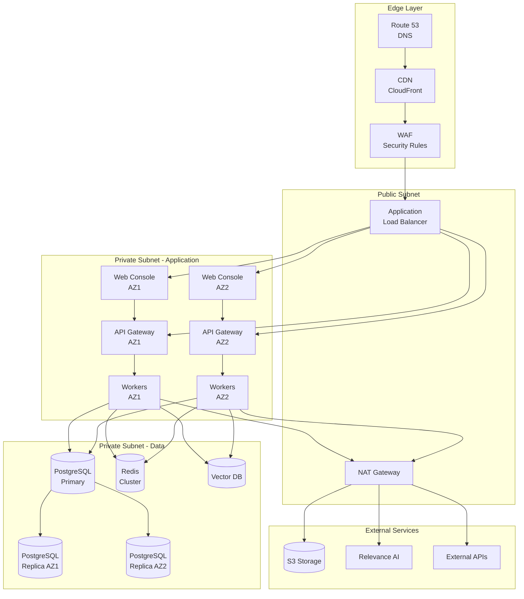
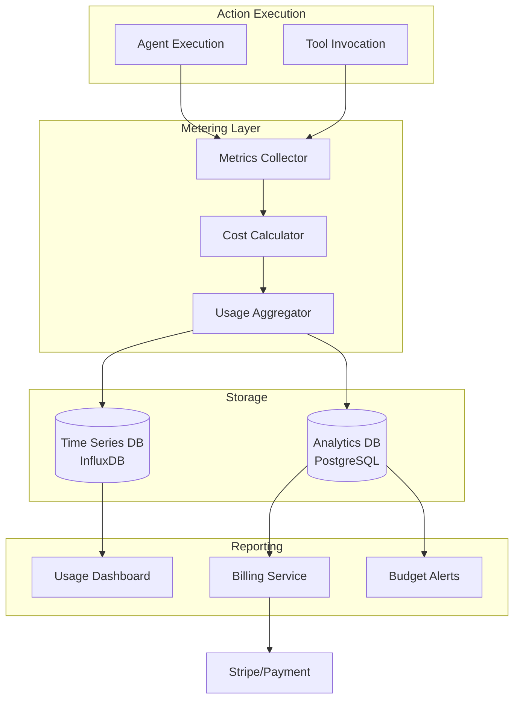
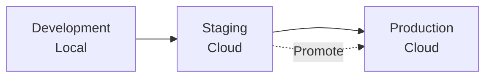

# Deployment Guide

**Version:** 1.0.0  
**Last Updated:** 2025-10-31  
**System:** Transform Army AI Platform

---

## Table of Contents

1. [Overview](#overview)
2. [Infrastructure Requirements](#infrastructure-requirements)
3. [Metering and Billing Architecture](#metering-and-billing-architecture)
4. [Deployment Environments](#deployment-environments)
5. [Phase 1: Relevance AI Deployment](#phase-1-relevance-ai-deployment)
6. [Phase 2: Adapter Service Deployment](#phase-2-adapter-service-deployment)
7. [Phase 3: Hybrid Orchestration Deployment](#phase-3-hybrid-orchestration-deployment)
8. [Phase 4: Full Platform Deployment](#phase-4-full-platform-deployment)
9. [Scaling Strategy](#scaling-strategy)
10. [Monitoring and Observability](#monitoring-and-observability)
11. [Disaster Recovery](#disaster-recovery)
12. [Security Operations](#security-operations)
13. [Cost Management](#cost-management)

---

## Overview

This guide provides comprehensive deployment specifications for the Transform Army AI platform across all phases of evolution, from Relevance-native deployment to a fully proprietary platform.

### Deployment Philosophy

- **Progressive Enhancement**: Start simple, add complexity as needed
- **Infrastructure as Code**: All infrastructure defined in version control
- **Zero-Downtime Deployments**: Blue-green deployments for all services
- **Observability First**: Comprehensive monitoring from day one
- **Cost Optimization**: Right-size resources, scale based on demand

---

## Infrastructure Requirements

### Compute Requirements

#### Phase 1 (Relevance-Native)

| Component | Specification | Quantity |
|-----------|--------------|----------|
| **Relevance AI** | Managed service | 1 organization |
| **Monitoring** | Basic analytics | Included |

**Monthly Cost Estimate**: $200-500 (based on Actions usage)

#### Phase 2 (Adapter Layer)

| Component | Specification | Quantity | Cost/Month |
|-----------|--------------|----------|------------|
| **Adapter Service** | 2 vCPU, 4GB RAM | 2 instances | $60 |
| **PostgreSQL** | Managed, 2 vCPU, 8GB RAM | 1 primary + 1 replica | $150 |
| **Redis** | Managed, 1GB memory | 1 instance | $30 |
| **Load Balancer** | Application LB | 1 | $25 |
| **Relevance AI** | Managed service | 1 organization | $300 |

**Total Monthly Cost**: ~$565

#### Phase 3 (Hybrid Orchestration)

| Component | Specification | Quantity | Cost/Month |
|-----------|--------------|----------|------------|
| **API Gateway** | Managed | 1M requests | $35 |
| **Adapter Service** | 4 vCPU, 8GB RAM | 3 instances | $180 |
| **LangGraph Workers** | 2 vCPU, 4GB RAM | 3 instances | $90 |
| **Web Console** | 2 vCPU, 4GB RAM | 2 instances | $60 |
| **PostgreSQL** | 4 vCPU, 16GB RAM | 1 primary + 2 replicas | $450 |
| **Vector DB** | Pinecone/Weaviate managed | 1 index | $70 |
| **Redis** | 4GB memory, cluster | 3 nodes | $120 |
| **Object Storage** | S3/equivalent | 100GB | $23 |
| **Load Balancers** | Application LB | 2 | $50 |
| **Relevance AI** | Managed (embeds only) | 1 organization | $200 |

**Total Monthly Cost**: ~$1,278

#### Phase 4 (Full Platform)

| Component | Specification | Quantity | Cost/Month |
|-----------|--------------|----------|------------|
| **API Gateway** | Managed | 10M requests | $105 |
| **Adapter Service** | 8 vCPU, 16GB RAM | 5 instances | $500 |
| **LangGraph Workers** | 4 vCPU, 8GB RAM | 8 instances | $480 |
| **Web Console** | 4 vCPU, 8GB RAM | 3 instances | $180 |
| **Auth Service** | 2 vCPU, 4GB RAM | 2 instances | $60 |
| **PostgreSQL** | 8 vCPU, 32GB RAM | 1 primary + 2 replicas | $900 |
| **Vector DB** | Enterprise tier | 3 indexes | $350 |
| **Redis** | 16GB memory, cluster | 6 nodes | $360 |
| **Object Storage** | S3/equivalent | 1TB | $230 |
| **CDN** | CloudFront/equivalent | 1TB transfer | $85 |
| **Load Balancers** | Application LB | 3 | $75 |
| **WAF** | Managed | 10M requests | $50 |
| **Backup Storage** | S3 Glacier | 500GB | $20 |

**Total Monthly Cost**: ~$3,395

### Network Architecture



---

## Metering and Billing Architecture

### Billing Model

Transform Army AI uses an **Actions/Credits** model aligned with Relevance AI's pricing structure.

#### Action Definition

An **Action** is a discrete unit of work performed by an agent:

```json
{
  "action_id": "act_abc123",
  "tenant_id": "tenant_001",
  "agent_id": "agent_bdr_001",
  "action_type": "crm.contact.create",
  "timestamp": "2025-10-31T01:17:00Z",
  "credits_consumed": {
    "llm_tokens": 1500,
    "llm_cost": 0.003,
    "tool_calls": 2,
    "tool_cost": 0.002,
    "total_credits": 5
  },
  "model": "claude-sonnet-3.5",
  "user_id": "user_456"
}
```

#### Credit Calculation

Credits are calculated based on:

1. **LLM Token Usage**: `tokens × model_rate`
2. **Tool API Calls**: Fixed cost per tool invocation
3. **Storage**: Vector embeddings and document storage
4. **Compute**: Complex workflow orchestration

**Example Credit Costs**:

| Activity | Credits |
|----------|---------|
| Simple agent response (1K tokens) | 1 |
| CRM search/update | 2 |
| Email send | 2 |
| Calendar booking | 3 |
| Knowledge search (vector) | 3 |
| Web scraping | 5 |
| Complex workflow (3+ agents) | 10-20 |

### Pricing Tiers

#### Starter Tier

**$299/month**
- 10,000 Actions included
- 3 agents
- 2 tool integrations
- 1 knowledge base (10K docs)
- Chat embed (1 domain)
- Email support

**Overages**: $0.05 per additional Action

#### Growth Tier

**$999/month**
- 50,000 Actions included
- 10 agents
- 5 tool integrations
- 3 knowledge bases (50K docs each)
- Chat embeds (5 domains)
- Workforce (multi-agent) enabled
- Priority support

**Overages**: $0.03 per additional Action

#### Enterprise Tier

**Custom pricing**
- Unlimited Actions (volume discount)
- Unlimited agents
- Unlimited tool integrations
- Unlimited knowledge bases
- White-label embeds
- SSO/SAML
- VPC deployment option
- Dedicated support
- SLA: 99.9% uptime

**BYO LLM Keys**: Bring your own API keys for:
- OpenAI (GPT-4, GPT-3.5)
- Anthropic (Claude)
- Google (Gemini)
- Custom endpoints

**Benefit**: No markup on model costs, only pay for platform usage

### Metering System Architecture



### Metering Implementation

```python
from datetime import datetime
from typing import Dict, Optional
import asyncio

class MeteringService:
    """Tracks and bills for agent actions"""
    
    def __init__(self, db, cache):
        self.db = db
        self.cache = cache
        self.credit_rates = self._load_credit_rates()
    
    async def record_action(
        self,
        action_id: str,
        tenant_id: str,
        agent_id: str,
        action_type: str,
        metadata: Dict
    ) -> ActionMeter:
        """Record action and calculate credits"""
        
        # Calculate credits
        credits = await self._calculate_credits(
            action_type=action_type,
            tokens=metadata.get("tokens", 0),
            tool_calls=metadata.get("tool_calls", []),
            model=metadata.get("model", "default")
        )
        
        # Store action record
        await self.db.execute(
            """
            INSERT INTO action_meters
            (action_id, tenant_id, agent_id, action_type, 
             credits, metadata, timestamp)
            VALUES ($1, $2, $3, $4, $5, $6, NOW())
            """,
            action_id, tenant_id, agent_id, action_type,
            credits, metadata
        )
        
        # Update tenant usage cache
        await self._update_tenant_usage(tenant_id, credits)
        
        # Check budget alerts
        await self._check_budget_alerts(tenant_id)
        
        return ActionMeter(
            action_id=action_id,
            credits=credits,
            timestamp=datetime.utcnow()
        )
    
    async def _calculate_credits(
        self,
        action_type: str,
        tokens: int,
        tool_calls: list,
        model: str
    ) -> float:
        """Calculate credit cost for action"""
        
        credits = 0.0
        
        # LLM token cost
        if tokens > 0:
            rate = self.credit_rates["models"][model]["per_1k_tokens"]
            credits += (tokens / 1000) * rate
        
        # Tool call costs
        for tool_call in tool_calls:
            tool_rate = self.credit_rates["tools"].get(
                tool_call["tool"],
                self.credit_rates["tools"]["default"]
            )
            credits += tool_rate
        
        # Base action cost
        action_rate = self.credit_rates["actions"].get(
            action_type,
            self.credit_rates["actions"]["default"]
        )
        credits += action_rate
        
        return credits
    
    async def _update_tenant_usage(
        self,
        tenant_id: str,
        credits: float
    ):
        """Update tenant's current period usage"""
        
        # Get billing period
        period_start = self._get_billing_period_start()
        
        # Increment usage in cache (fast)
        cache_key = f"usage:{tenant_id}:{period_start}"
        await self.cache.incrbyfloat(cache_key, credits)
        
        # Update database (periodic batch)
        await self.db.execute(
            """
            INSERT INTO tenant_usage 
            (tenant_id, period_start, credits_used, last_updated)
            VALUES ($1, $2, $3, NOW())
            ON CONFLICT (tenant_id, period_start)
            DO UPDATE SET
                credits_used = tenant_usage.credits_used + $3,
                last_updated = NOW()
            """,
            tenant_id, period_start, credits
        )
    
    async def _check_budget_alerts(self, tenant_id: str):
        """Check if tenant approaching budget limit"""
        
        # Get tenant plan and usage
        plan = await self._get_tenant_plan(tenant_id)
        usage = await self.get_current_usage(tenant_id)
        
        included_credits = plan["included_actions"]
        used_percentage = (usage / included_credits) * 100
        
        # Alert thresholds
        if used_percentage >= 90 and not await self._alert_sent(tenant_id, 90):
            await self._send_budget_alert(
                tenant_id,
                threshold=90,
                usage=usage,
                limit=included_credits
            )
        elif used_percentage >= 75 and not await self._alert_sent(tenant_id, 75):
            await self._send_budget_alert(
                tenant_id,
                threshold=75,
                usage=usage,
                limit=included_credits
            )
    
    async def get_current_usage(self, tenant_id: str) -> float:
        """Get tenant's current billing period usage"""
        
        period_start = self._get_billing_period_start()
        cache_key = f"usage:{tenant_id}:{period_start}"
        
        # Try cache first
        usage = await self.cache.get(cache_key)
        if usage:
            return float(usage)
        
        # Fallback to database
        row = await self.db.fetchrow(
            """
            SELECT credits_used 
            FROM tenant_usage
            WHERE tenant_id = $1 AND period_start = $2
            """,
            tenant_id, period_start
        )
        
        return row["credits_used"] if row else 0.0
    
    async def calculate_bill(
        self,
        tenant_id: str,
        period_start: str,
        period_end: str
    ) -> Bill:
        """Calculate bill for billing period"""
        
        # Get plan
        plan = await self._get_tenant_plan(tenant_id)
        
        # Get total usage
        usage = await self.db.fetchrow(
            """
            SELECT SUM(credits) as total_credits,
                   COUNT(*) as total_actions
            FROM action_meters
            WHERE tenant_id = $1
              AND timestamp >= $2
              AND timestamp < $3
            """,
            tenant_id, period_start, period_end
        )
        
        total_credits = usage["total_credits"] or 0
        total_actions = usage["total_actions"] or 0
        
        # Calculate charges
        base_charge = plan["monthly_price"]
        included_actions = plan["included_actions"]
        overage_rate = plan["overage_rate"]
        
        overage_actions = max(0, total_actions - included_actions)
        overage_charge = overage_actions * overage_rate
        
        total_charge = base_charge + overage_charge
        
        return Bill(
            tenant_id=tenant_id,
            period_start=period_start,
            period_end=period_end,
            base_charge=base_charge,
            included_actions=included_actions,
            total_actions=total_actions,
            overage_actions=overage_actions,
            overage_charge=overage_charge,
            total_charge=total_charge,
            credits_used=total_credits
        )
```

### BYO LLM Key Support

```python
class TenantCredentialManager:
    """Manages tenant-provided LLM API keys"""
    
    async def store_llm_key(
        self,
        tenant_id: str,
        provider: str,
        api_key: str
    ):
        """Store encrypted LLM API key"""
        
        # Encrypt key
        encrypted_key = await self.vault.encrypt(api_key)
        
        # Store in vault
        await self.db.execute(
            """
            INSERT INTO tenant_llm_keys
            (tenant_id, provider, encrypted_key, created_at)
            VALUES ($1, $2, $3, NOW())
            ON CONFLICT (tenant_id, provider)
            DO UPDATE SET
                encrypted_key = $3,
                updated_at = NOW()
            """,
            tenant_id, provider, encrypted_key
        )
    
    async def get_llm_key(
        self,
        tenant_id: str,
        provider: str
    ) -> Optional[str]:
        """Retrieve and decrypt LLM API key"""
        
        row = await self.db.fetchrow(
            """
            SELECT encrypted_key
            FROM tenant_llm_keys
            WHERE tenant_id = $1 AND provider = $2
            """,
            tenant_id, provider
        )
        
        if not row:
            return None
        
        # Decrypt key
        api_key = await self.vault.decrypt(row["encrypted_key"])
        
        return api_key
    
    async def use_byo_key(self, tenant_id: str, provider: str) -> bool:
        """Check if tenant has BYO key configured"""
        
        key = await self.get_llm_key(tenant_id, provider)
        return key is not None
```

### Cost Attribution

```python
class CostAttribution:
    """Attribute costs to tenants, projects, users"""
    
    async def get_cost_breakdown(
        self,
        tenant_id: str,
        start_date: str,
        end_date: str,
        group_by: str = "agent"
    ) -> Dict:
        """Get cost breakdown by dimension"""
        
        query = f"""
            SELECT 
                {group_by},
                COUNT(*) as action_count,
                SUM(credits) as total_credits,
                AVG(credits) as avg_credits,
                SUM(CASE WHEN metadata->>'byo_key' = 'true' 
                    THEN 0 ELSE credits END) as platform_credits
            FROM action_meters
            WHERE tenant_id = $1
              AND timestamp >= $2
              AND timestamp < $3
            GROUP BY {group_by}
            ORDER BY total_credits DESC
        """
        
        rows = await self.db.fetch(query, tenant_id, start_date, end_date)
        
        return {
            "breakdown": [dict(row) for row in rows],
            "total_actions": sum(r["action_count"] for r in rows),
            "total_credits": sum(r["total_credits"] for r in rows)
        }
```

---

## Deployment Environments

### Environment Strategy



### Environment Specifications

| Environment | Purpose | Data | Scale |
|-------------|---------|------|-------|
| **Development** | Local development | Synthetic | 1x |
| **Staging** | Pre-production testing | Anonymized production | 0.5x |
| **Production** | Live customer traffic | Real data | Full scale |

### Configuration Management

```yaml
# config/environments/production.yaml
environment: production
region: us-east-1

api_gateway:
  domain: api.transform-army.ai
  rate_limit: 10000
  
adapter_service:
  replicas: 5
  cpu: 8
  memory: 16Gi
  autoscaling:
    min: 3
    max: 20
    target_cpu: 70

langgraph_workers:
  replicas: 8
  cpu: 4
  memory: 8Gi
  autoscaling:
    min: 5
    max: 50
    target_queue_depth: 100

database:
  instance_type: db.r6g.2xlarge
  multi_az: true
  replicas: 2
  backup_retention: 30

vector_db:
  provider: pinecone
  tier: p2
  pods: 3

redis:
  instance_type: cache.r6g.xlarge
  cluster_mode: enabled
  replicas: 6

monitoring:
  metrics_retention: 90d
  logs_retention: 30d
  traces_retention: 7d
```

---

## Phase 1: Relevance AI Deployment

### Setup Checklist

- [ ] Create Relevance AI organization
- [ ] Configure authentication (SSO if available)
- [ ] Create base agents (6 agents)
- [ ] Configure tool integrations
- [ ] Set up knowledge bases
- [ ] Create workforce templates
- [ ] Configure embeds
- [ ] Set up usage monitoring
- [ ] Train operators

### Agent Configuration

Each agent requires:

1. **System Prompt**: Defined in [`packages/agents/{agent-name}/prompt.md`](packages/agents/)
2. **Tools**: List of Relevance tools (CRM, email, calendar, etc.)
3. **Knowledge**: Assigned knowledge base IDs
4. **Model**: LLM model selection (Claude Sonnet 3.5 recommended)
5. **Temperature**: 0.2 for deterministic, 0.7 for creative

### Monitoring Setup

**Relevance AI Analytics**:
- Action usage per agent
- Token consumption
- Tool invocation frequency
- Error rates

**External Monitoring** (if needed):
- Webhook to log all actions to external system
- Daily usage reports via email
- Budget alerts at 75% and 90%

---

## Phase 2: Adapter Service Deployment

### Infrastructure Setup

```bash
# 1. Provision infrastructure with Terraform
cd infra/terraform/phase2
terraform init
terraform plan -var-file=production.tfvars
terraform apply

# 2. Deploy adapter service
cd apps/adapter
docker build -t transform-army/adapter:v1.0.0 .
docker push transform-army/adapter:v1.0.0

# 3. Deploy to production
kubectl apply -f infra/k8s/adapter-service/
kubectl rollout status deployment/adapter-service

# 4. Run database migrations
kubectl exec -it adapter-service-xxx -- alembic upgrade head

# 5. Verify health
curl https://adapter.transform-army.ai/health
```

### Database Schema

```sql
-- Tenants
CREATE TABLE tenants (
    tenant_id VARCHAR(50) PRIMARY KEY,
    name VARCHAR(255) NOT NULL,
    plan VARCHAR(50) NOT NULL,
    status VARCHAR(20) DEFAULT 'active',
    created_at TIMESTAMP DEFAULT NOW(),
    updated_at TIMESTAMP DEFAULT NOW()
);

-- Tenant credentials (encrypted)
CREATE TABLE tenant_credentials (
    credential_id VARCHAR(50) PRIMARY KEY,
    tenant_id VARCHAR(50) REFERENCES tenants(tenant_id),
    provider VARCHAR(50) NOT NULL,
    encrypted_data TEXT NOT NULL,
    created_at TIMESTAMP DEFAULT NOW(),
    UNIQUE(tenant_id, provider)
);

-- Action meters
CREATE TABLE action_meters (
    action_id VARCHAR(50) PRIMARY KEY,
    tenant_id VARCHAR(50) REFERENCES tenants(tenant_id),
    agent_id VARCHAR(50) NOT NULL,
    action_type VARCHAR(100) NOT NULL,
    credits DECIMAL(10,4) NOT NULL,
    metadata JSONB,
    timestamp TIMESTAMP DEFAULT NOW()
);

CREATE INDEX idx_action_meters_tenant_timestamp 
ON action_meters(tenant_id, timestamp DESC);

-- Audit log
CREATE TABLE audit_log (
    event_id VARCHAR(50) PRIMARY KEY,
    tenant_id VARCHAR(50) REFERENCES tenants(tenant_id),
    actor_type VARCHAR(20) NOT NULL,
    actor_id VARCHAR(50) NOT NULL,
    action VARCHAR(100) NOT NULL,
    resource_type VARCHAR(50),
    resource_id VARCHAR(50),
    status VARCHAR(20) NOT NULL,
    metadata JSONB,
    timestamp TIMESTAMP DEFAULT NOW()
);

CREATE INDEX idx_audit_log_tenant_timestamp 
ON audit_log(tenant_id, timestamp DESC);
```

### Adapter Service Configuration

```python
# config.py
from pydantic_settings import BaseSettings

class Settings(BaseSettings):
    # Service
    service_name: str = "adapter-service"
    version: str = "1.0.0"
    environment: str = "production"
    
    # API
    host: str = "0.0.0.0"
    port: int = 8000
    cors_origins: list = ["https://console.transform-army.ai"]
    
    # Database
    database_url: str
    database_pool_size: int = 20
    database_max_overflow: int = 10
    
    # Redis
    redis_url: str
    redis_pool_size: int = 10
    
    # Auth
    jwt_secret: str
    jwt_algorithm: str = "HS256"
    jwt_expiration: int = 3600
    
    # Rate limiting
    rate_limit_per_minute: int = 100
    
    # Monitoring
    sentry_dsn: str = ""
    datadog_api_key: str = ""
    
    class Config:
        env_file = ".env"
```

---

## Phase 3: Hybrid Orchestration Deployment

### LangGraph Worker Deployment

```yaml
# infra/k8s/langgraph-workers/deployment.yaml
apiVersion: apps/v1
kind: Deployment
metadata:
  name: langgraph-workers
spec:
  replicas: 8
  selector:
    matchLabels:
      app: langgraph-workers
  template:
    metadata:
      labels:
        app: langgraph-workers
    spec:
      containers:
      - name: worker
        image: transform-army/langgraph-worker:v1.0.0
        resources:
          requests:
            cpu: 2000m
            memory: 4Gi
          limits:
            cpu: 4000m
            memory: 8Gi
        env:
        - name: DATABASE_URL
          valueFrom:
            secretKeyRef:
              name: database-credentials
              key: url
        - name: REDIS_URL
          valueFrom:
            secretKeyRef:
              name: redis-credentials
              key: url
        - name: VECTOR_DB_URL
          valueFrom:
            secretKeyRef:
              name: vector-db-credentials
              key: url
        livenessProbe:
          httpGet:
            path: /health
            port: 8080
          initialDelaySeconds: 30
          periodSeconds: 10
        readinessProbe:
          httpGet:
            path: /ready
            port: 8080
          initialDelaySeconds: 10
          periodSeconds: 5
---
apiVersion: autoscaling/v2
kind: HorizontalPodAutoscaler
metadata:
  name: langgraph-workers
spec:
  scaleTargetRef:
    apiVersion: apps/v1
    kind: Deployment
    name: langgraph-workers
  minReplicas: 5
  maxReplicas: 50
  metrics:
  - type: Resource
    resource:
      name: cpu
      target:
        type: Utilization
        averageUtilization: 70
  - type: Pods
    pods:
      metric:
        name: queue_depth
      target:
        type: AverageValue
        averageValue: "100"
```

### Vector Database Setup

```python
# Initialize Pinecone
import pinecone

pinecone.init(
    api_key=settings.pinecone_api_key,
    environment=settings.pinecone_environment
)

# Create index for knowledge base
if "knowledge-base" not in pinecone.list_indexes():
    pinecone.create_index(
        name="knowledge-base",
        dimension=1536,  # OpenAI embeddings
        metric="cosine",
        pods=3,
        pod_type="p2.x1"
    )

# Use index
index = pinecone.Index("knowledge-base")
```

---

## Phase 4: Full Platform Deployment

### Kubernetes Architecture

```yaml
# infra/k8s/platform/namespace.yaml
apiVersion: v1
kind: Namespace
metadata:
  name: transform-army-production
---
# API Gateway
apiVersion: v1
kind: Service
metadata:
  name: api-gateway
  namespace: transform-army-production
spec:
  type: LoadBalancer
  selector:
    app: api-gateway
  ports:
  - port: 443
    targetPort: 8080
---
# Web Console
apiVersion: apps/v1
kind: Deployment
metadata:
  name: web-console
  namespace: transform-army-production
spec:
  replicas: 3
  selector:
    matchLabels:
      app: web-console
  template:
    metadata:
      labels:
        app: web-console
    spec:
      containers:
      - name: nextjs
        image: transform-army/web-console:v1.0.0
        ports:
        - containerPort: 3000
        resources:
          requests:
            cpu: 2000m
            memory: 4Gi
          limits:
            cpu: 4000m
            memory: 8Gi
```

### SSL/TLS Configuration

```yaml
# infra/k8s/platform/ingress.yaml
apiVersion: networking.k8s.io/v1
kind: Ingress
metadata:
  name: transform-army-ingress
  annotations:
    cert-manager.io/cluster-issuer: letsencrypt-prod
    nginx.ingress.kubernetes.io/ssl-redirect: "true"
spec:
  tls:
  - hosts:
    - transform-army.ai
    - api.transform-army.ai
    - console.transform-army.ai
    secretName: transform-army-tls
  rules:
  - host: api.transform-army.ai
    http:
      paths:
      - path: /
        pathType: Prefix
        backend:
          service:
            name: api-gateway
            port:
              number: 8080
  - host: console.transform-army.ai
    http:
      paths:
      - path: /
        pathType: Prefix
        backend:
          service:
            name: web-console
            port:
              number: 3000
```

---

## Scaling Strategy

### Horizontal Scaling

**Auto-scaling triggers**:

| Component | Metric | Threshold | Action |
|-----------|--------|-----------|--------|
| Adapter Service | CPU | > 70% | Scale up |
| Adapter Service | CPU | < 30% | Scale down |
| LangGraph Workers | Queue depth | > 100 | Scale up |
| LangGraph Workers | Queue depth | < 20 | Scale down |
| Web Console | Request rate | > 1000 req/s | Scale up |

### Vertical Scaling

**Resource adjustments**:
- Monitor P95 latency and memory usage
- Scale up if consistently hitting limits
- Schedule scaling during low-traffic windows

### Database Scaling

**Read scaling**: Add read replicas
- Route read queries to replicas
- Write queries to primary only
- Monitor replication lag

**Write scaling**: Partition by tenant
- Shard database by tenant_id
- Co-locate tenant data for queries
- Use distributed SQL if needed (CockroachDB, YugabyteDB)

---

## Monitoring and Observability

### Metrics Collection

```yaml
# prometheus-config.yaml
global:
  scrape_interval: 15s
  evaluation_interval: 15s

scrape_configs:
  - job_name: 'adapter-service'
    kubernetes_sd_configs:
      - role: pod
    relabel_configs:
      - source_labels: [__meta_kubernetes_pod_label_app]
        regex: adapter-service
        action: keep
  
  - job_name: 'langgraph-workers'
    kubernetes_sd_configs:
      - role: pod
    relabel_configs:
      - source_labels: [__meta_kubernetes_pod_label_app]
        regex: langgraph-workers
        action: keep
```

### Key Metrics

**Application Metrics**:
- `action_count` - Total actions executed
- `action_duration_seconds` - Action execution time
- `action_errors_total` - Failed actions
- `credits_consumed` - Credit usage
- `queue_depth` - Pending workflows

**System Metrics**:
- `cpu_usage_percent` - CPU utilization
- `memory_usage_bytes` - Memory consumption
- `disk_io_ops` - Disk operations
- `network_bytes_transmitted` - Network traffic

**Business Metrics**:
- `active_tenants` - Active customers
- `monthly_recurring_revenue` - MRR
- `churn_rate` - Customer churn
- `nps_score` - Net Promoter Score

### Logging Strategy

```python
# Structured logging
import structlog

logger = structlog.get_logger()

logger.info(
    "action_executed",
    action_id="act_abc123",
    tenant_id="tenant_001",
    agent_id="bdr_concierge",
    duration_ms=245,
    credits=5.0,
    success=True
)
```

### Alerting Rules

```yaml
# alerting-rules.yaml
groups:
  - name: platform_alerts
    interval: 30s
    rules:
      - alert: HighErrorRate
        expr: rate(action_errors_total[5m]) > 0.05
        for: 5m
        labels:
          severity: critical
        annotations:
          summary: "High error rate detected"
          description: "Error rate is {{ $value }} errors/sec"
      
      - alert: HighLatency
        expr: histogram_quantile(0.95, rate(action_duration_seconds_bucket[5m])) > 10
        for: 5m
        labels:
          severity: warning
        annotations:
          summary: "High P95 latency detected"
          description: "P95 latency is {{ $value }} seconds"
      
      - alert: DatabaseReplicationLag
        expr: pg_replication_lag_seconds > 60
        for: 5m
        labels:
          severity: warning
        annotations:
          summary: "Database replication lag high"
          description: "Lag is {{ $value }} seconds"
```

---

## Disaster Recovery

### Backup Strategy

**Database Backups**:
- Automated daily snapshots
- Point-in-time recovery enabled (PITR)
- Retention: 30 days hot, 1 year cold
- Cross-region replication for critical data

**Object Storage Backups**:
- Versioning enabled on S3 buckets
- Lifecycle policy: Archive to Glacier after 90 days
- Retention: 7 years for compliance

### Recovery Procedures

#### Database Recovery

```bash
# Restore from snapshot
aws rds restore-db-instance-from-db-snapshot \
  --db-instance-identifier transform-army-restored \
  --db-snapshot-identifier transform-army-snapshot-2025-10-30

# Point-in-time recovery
aws rds restore-db-instance-to-point-in-time \
  --source-db-instance-identifier transform-army-production \
  --target-db-instance-identifier transform-army-restored \
  --restore-time 2025-10-30T01:00:00Z
```

#### Application Recovery

```bash
# Rollback to previous version
kubectl rollout undo deployment/adapter-service -n transform-army-production

# Check rollout status
kubectl rollout status deployment/adapter-service -n transform-army-production
```

### Business Continuity

**RTO (Recovery Time Objective)**: < 1 hour
**RPO (Recovery Point Objective)**: < 5 minutes

**Incident Response Plan**:
1. Detect incident via monitoring alerts
2. Assess impact and severity
3. Activate incident response team
4. Execute recovery procedures
5. Communicate with affected customers
6. Post-incident review and improvements

---

## Security Operations

### Security Monitoring

**Tools**:
- AWS GuardDuty for threat detection
- Falco for runtime security
- OSSEC for intrusion detection
- Snyk for dependency scanning

**Security Events to Monitor**:
- Failed authentication attempts
- Privilege escalation
- Unusual API access patterns
- Data exfiltration attempts
- Malware detection

### Vulnerability Management

```bash
# Scan container images
trivy image transform-army/adapter:v1.0.0

# Scan dependencies
snyk test

# Scan infrastructure
checkov -d infra/terraform/
```

### Compliance

**SOC 2 Type II Requirements**:
- Access controls and authentication
- Encryption at rest and in transit
- Security monitoring and incident response
- Change management procedures
- Vendor risk management

**GDPR Compliance**:
- Data portability (export functionality)
- Right to be forgotten (data deletion)
- Consent management
- Data processing agreements

---

## Cost Management

### Cost Optimization Strategies

1. **Right-size Resources**: Monitor actual usage and adjust
2. **Reserved Instances**: 1-3 year commitments for predictable workloads
3. **Spot Instances**: Use for non-critical workloads
4. **Auto-scaling**: Scale down during low-traffic periods
5. **S3 Lifecycle Policies**: Move data to cheaper storage tiers
6. **CDN Caching**: Reduce origin requests and bandwidth

### Cost Allocation

```python
# Tag all resources for cost tracking
tags = {
    "Environment": "production",
    "Service": "transform-army",
    "Component": "adapter-service",
    "Team": "platform",
    "CostCenter": "engineering"
}
```

### Budget Alerts

```yaml
# AWS Budget
Budget:
  Name: TransformArmyProduction
  BudgetType: COST
  TimeUnit: MONTHLY
  BudgetLimit:
    Amount: 5000
    Unit: USD
  Notifications:
    - NotificationType: ACTUAL
      Threshold: 80
      ThresholdType: PERCENTAGE
      ComparisonOperator: GREATER_THAN
      SubscriberEmailAddresses:
        - alerts@transform-army.ai
```

---

## Operational Runbooks

### Common Operations

#### Deploy New Version

```bash
#!/bin/bash
# deploy.sh

VERSION=$1
COMPONENT=$2

echo "Deploying ${COMPONENT} version ${VERSION}"

# Build and push image
docker build -t transform-army/${COMPONENT}:${VERSION} .
docker push transform-army/${COMPONENT}:${VERSION}

# Update deployment
kubectl set image deployment/${COMPONENT} \
  ${COMPONENT}=transform-army/${COMPONENT}:${VERSION} \
  -n transform-army-production

# Wait for rollout
kubectl rollout status deployment/${COMPONENT} \
  -n transform-army-production --timeout=5m

echo "Deployment complete"
```

#### Add New Tenant

```python
# scripts/add_tenant.py
import asyncio
from app.services.tenant import TenantService

async def add_tenant(name: str, plan: str, email: str):
    """Create new tenant"""
    
    tenant_service = TenantService()
    
    tenant = await tenant_service.create_tenant(
        name=name,
        plan=plan,
        admin_email=email
    )
    
    print(f"Tenant created: {tenant.tenant_id}")
    print(f"API Key: {tenant.api_key}")
    
    return tenant

# Usage
# python scripts/add_tenant.py --name "Acme Corp" --plan "growth" --email "admin@acme.com"
```

#### Rotate API Keys

```python
# scripts/rotate_api_key.py
async def rotate_api_key(tenant_id: str):
    """Rotate tenant API key"""
    
    # Generate new key
    new_key = generate_api_key()
    
    # Update database
    await db.execute(
        """
        UPDATE tenants
        SET api_key = $1,
            previous_api_key = api_key,
            key_rotated_at = NOW()
        WHERE tenant_id = $2
        """,
        new_key, tenant_id
    )
    
    # Notify tenant
    await notify_tenant_key_rotation(tenant_id, new_key)
    
    # Grace period: Accept both keys for 24 hours
    await schedule_key_deprecation(tenant_id, hours=24)
    
    return new_key
```

---

## Appendix

### Tool Versions

| Tool | Version | Purpose |
|------|---------|---------|
| Kubernetes | 1.28+ | Container orchestration |
| PostgreSQL | 15+ | Primary database |
| Redis | 7+ | Cache and queues |
| Terraform | 1.6+ | Infrastructure as Code |
| Docker | 24+ | Containerization |
| Python | 3.11+ | Backend services |
| Node.js | 20+ | Frontend application |

### Resource Links

- [AWS Best Practices](https://aws.amazon.com/architecture/well-architected/)
- [Kubernetes Production Best Practices](https://learnk8s.io/production-best-practices)
- [PostgreSQL High Availability](https://www.postgresql.org/docs/current/high-availability.html)
- [FastAPI Deployment](https://fastapi.tiangolo.com/deployment/)
- [Next.js Production Deployment](https://nextjs.org/docs/deployment)

---

**Document Control**

| Version | Date | Author | Changes |
|---------|------|--------|---------|
| 1.0.0 | 2025-10-31 | Architecture Team | Initial deployment guide |